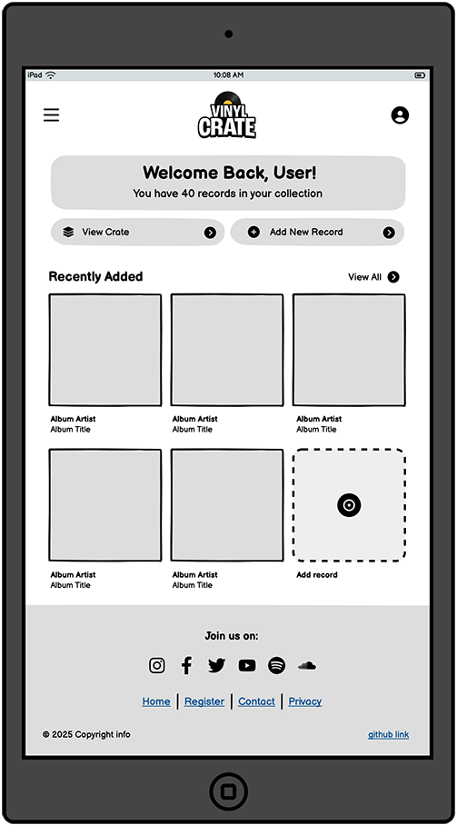

# Vinyl Crate

**Vinyl Crate** is a full-stack record collection management web application built using Django, Python, HTML, CSS, and JavaScript. The app uses PostgreSQL for data storage and is deployed to Heroku with a responsive front-end styled using Bootstrap.

This project was created as my third milestone project for the Level 5 Diploma in Web Application Development with the Code Institute.

---

##  User Experience (UX)

### Strategy Plane

#### **Project Goals**

**Vinyl Crate** is a **personal record collection management app** created for vinyl enthusiasts, DJs, and music collectors. The platform allows users to build and organise a digital library of their physical records — complete with metadata such as artist, title, genre, BPM, musical key, and cover art.

This app is designed to replace basic spreadsheets and paper lists with a user-friendly, mobile-responsive interface. Users can easily search, filter, and update their collections on the go — whether they're browsing at home, preparing a DJ set, or crate digging in a record shop.

Vinyl records have seen a major resurgence in popularity, and tools like **Vinyl Crate** empower collectors to track, rate, and catalogue their collections in a modern, cloud-based format. Built as part of a Level 5 Web Application Development course, Vinyl Crate focuses on usability, functionality, and clean design to deliver a polished user experience for managing music libraries.

#### Target Audience

Whether you're tracking rare jazz pressings, building a DJ setlist, or simply documenting your growing collection, Vinyl Crate offers a streamlined, flexible space to manage your vinyl library.

**Vinyl Crate** is designed for:

- 🎵 **Vinyl collectors** who want an organised, digital catalogue of their records  
- 🎧 **DJs** who need quick access to metadata like BPM, key, and genre  
- 📱 **Mobile users** looking for a responsive tool they can access from the record shop or DJ booth  
- 🧠 **Music enthusiasts** who enjoy reflecting on and rating their collection  
- 📂 **Users** who want to move beyond spreadsheets and static lists

**Vinyl Crate** provides:

- 📀 **Personal record management** – Add, edit, and browse your vinyl collection
- ⭐ **Custom metadata fields** – Track BPM, musical key, year, genre, and star ratings
- 🖼️ **Visual enhancements** – Upload and display album artwork
- 🔐 **Secure access** – Private user accounts and dashboard views
- 📱 **Mobile-ready** – Use it from the crate or the couch

---

### Scope Plane

#### **Feature Planning**

The table below outlines opportunities for the **Vinyl Crate** project. Each feature has been scored for **importance** and **viability** (1 = low, 5 = high). This helps prioritise core functionality for the MVP. Features scoring highly are **must-haves**, while mid-scoring features are **should-haves**, and low-priority features are **could-haves** for future versions.

User roles are also considered in the planning:
- **Guests** – Unauthenticated visitors browsing public-facing content
- **Users** – Registered members with a personalised dashboard
- **Admins** – Staff or superusers with additional content management access

| User Type     | Feature                                      | Importance | Viability | Scope   | Delivered |
|:------------- |:-------------------------------------------- |:----------:|:---------:|:-------:|:---------:|
| All           | View public landing page                     | 5          | 5         | MVP     | ✅        |
| Guest         | Register for an account                      | 5          | 5         | MVP     | ✅        |
| User          | Log in/out and manage session                | 5          | 5         | MVP     | ✅        |
| User          | Password recovery                            | 5          | 5         | MVP     | ⬜        |
| User          | Create, view, update, delete own records     | 5          | 5         | MVP     | ✅        |
| User          | Upload cover image for record                | 5          | 5         | MVP     | ✅        |
| User          | Add individual tracks to each record         | 5          | 4         | MVP     | ✅        |
| Admin         | Access Django admin panel                    | 5          | 5         | MVP     | ✅        |
| Admin         | Moderate/edit user records via admin         | 5          | 5         | MVP     | ⬜        |
| Admin         | Edit track list inline in Record admin panel | 4          | 5         | Should  | ✅        |
| User          | Filter/sort by genre, year, BPM, rating      | 4          | 5         | Should  | ✅        |
| User          | Search records by title/artist               | 4          | 4         | Should  | ✅        |
| User          | Include BPM, key, and duration per track     | 4          | 4         | Should  | ✅        |
| All           | Responsive design / Bootstrap UI             | 4          | 5         | MVP     | ✅        |
| All           | View mobile-friendly site                    | 4          | 5         | MVP     | ⬜        |
| User          | Rate records with 1–5 stars                  | 4          | 5         | MVP     | ✅        |
| User          | Use dropdowns for genre and key              | 4          | 5         | MVP     | ✅        |
| User          | Export collection as CSV                     | 3          | 4         | Could   | ⬜        |
| Guest         | Social media login/sign-up                   | 3          | 4         | Could   | ⬜        |
| Admin         | Automatically show total track count per record | 3          | 3         | Could   | ⬜        |
| User          | Edit/update account profile                  | 2          | 3         | Could   | ⬜        |
| All           | Custom 404 and 500 error pages               | 2          | 4         | Could   | ⬜        |
| All           | About/Contact page                           | 2          | 3         | Could   | ⬜        |
| User          | Pre-populated demo records / staff picks     | 2          | 3         | Could   | ✅        |

---

### Structure Plane

#### **User Stories**

| ID | As a/an        | I want to be able to...                             | So that I can... |
|:---|:---------------|:----------------------------------------------------|:-----------------|
| 1  | New Visitor    | Browse a public record or staff-picked collection   | See what the site is about before registering |
| 2  | New Visitor    | View example record entries with metadata           | Understand how records are displayed and organised |
| 3  | New Visitor    | See a clear sign-up or log-in prompt                | Know how to get started |
| 4  | User           | Register and log in                                 | Access my personal dashboard and collection |
| 5  | User           | Add new records to my collection                    | Keep an up-to-date log of the vinyl I own |
| 6  | User           | Upload a cover image for a record                   | Make my collection visually rich |
| 7  | User           | Edit existing records                               | Correct mistakes or update metadata |
| 8  | User           | Delete a record from my collection                  | Keep my library clean and relevant |
| 9  | User           | View full details for a single record               | See all metadata and visuals in one place |
| 10 | User           | Sort and filter my collection                       | Quickly find records by genre, BPM, or rating |
| 11 | User           | Search for a specific record                        | Find entries fast without scrolling |
| 12 | User           | Rate a record using 1–5 stars                       | Track how much I value or enjoy a record |
| 13 | User           | Export my collection as a CSV                       | Back it up or use it in another system |
| 14 | User           | Recover my password                                 | Regain access if I forget my login details |
| 15 | User           | Edit my account profile                             | Update my display name, location, or bio |
| 16 | User           | Sign in via social media (optional)                 | Log in more quickly or conveniently |
| 17 | User           | Add individual tracks to each record                | Log full tracklists for more detailed entries |
| 18 | User           | Include BPM, key, and duration for each track       | Help with DJing or playlist curation |
| 19 | Admin          | Access the Django admin panel                       | Manage users and records directly |
| 20 | Admin          | Edit or delete any record in the system             | Support users and maintain database integrity |
| 21 | Admin          | Review user-submitted content                       | Ensure the platform remains clean and appropriate |
| 22 | Admin          | Manage tracks directly from the Record admin view   | Save time editing metadata without switching models |
| 23 | Mobile User    | Access my collection on a phone or tablet           | View or update records while crate digging or DJing |
| 24 | Mobile User    | Upload cover images from my device                  | Add new records quickly without needing a computer |

*All user stories were manually tested. See [ User Story Testing]() for full test results.*

#### **Database Schema**

For this project, a relational database (PostgreSQL) was selected, as it offers the structure and referential integrity needed to manage user-specific vinyl collections efficiently.

The **initial MVP** focused on a single `Record` model linked to the built-in Django User model. This model stored essential metadata such as title, artist, genre, release year, rating, and a cover image. This simple structure allowed for quick prototyping, admin integration, and CRUD functionality.

However, during development it became clear that additional detail was needed to represent **individual tracks** on a vinyl release. Features such as **track position, duration, BPM**, and **musical key** were specific to tracks — not records. Initially, BPM and key were part of the `Record` model, but this proved insufficient for multi-track records where values vary per track.

To resolve this, a dedicated `Track` model was introduced. Each track is linked to a `Record` via a foreign key relationship, enabling accurate representation of vinyl releases with multiple tracks per side. The database was updated accordingly to reflect this one-to-many relationship. The BPM and key fields were also moved from `Record` to `Track`, where they more logically belong.

This structure ensures scalability and aligns with database best practices by reducing redundancy and improving data clarity.

#### Typography

[Google Fonts](https://fonts.google.com/) was used to import the selected fonts for the site, ensuring high-quality and accessible typography across all devices and browsers.

- **Headings (h1, h2, h3):** The font [Montserrat](https://fonts.google.com/specimen/Montserrat) was chosen for its bold, geometric style that provides a clean, modern look. Its sharp edges and contemporary design help headlines stand out, giving the site a distinctive and polished visual identity while remaining easy to read.

- **Paragraphs and body text:** The font [Lato](https://fonts.google.com/specimen/Lato) was selected for body copy due to its warm, friendly tone and excellent legibility at various sizes. It complements Montserrat without competing for attention, supporting a harmonious and user-friendly reading experience throughout the site.

- **Icons and UI elements:** The [Font Awesome](https://fontawesome.com/) icon library was used to support the visual interface with clear, scalable icons. These icons align stylistically with the modern fonts and enhance user experience through recognizable visual cues for actions, navigation, and social media links.

 

#### Imagery

The imagery selected for this project was chosen to resonate with vinyl collectors and DJs — the app's core audience. The carousel banners feature high-quality visuals sourced from [Adobe Stock](https://stock.adobe.com/), showcasing vinyl records, listening setups, and DJ environments to immediately immerse users in the culture and aesthetics of record collecting.

The example record covers displayed in the application were sourced from [Discogs](https://www.discogs.com/) to reflect real-world artwork and enhance authenticity. These visuals not only demonstrate how the app works but also give prospective users a sense of the interface when populated with their own collection.

Overall, the use of clean, bold, and culturally relevant imagery reinforces the platform’s purpose: celebrating analogue music collections in a modern digital format.

 

### Skeleton Plane

#### **Wireframes**

Initial wireframes were created using [Balsamiq](https://balsamiq.com/) to plan the core layout and flow of the **Vinyl Crate** site. These included views for mobile, tablet, and desktop to ensure the design would be fully responsive and accessible.

The wireframes helped shape the site’s information hierarchy and user journey, including key screens such as the homepage, dashboard, record collection view, and record detail view. They served as a visual blueprint during development, guiding the placement of search, filter, and CRUD functionality with a mobile-first mindset.

 

#### **Mobile Wireframes**

 Click here to see the Mobile Wireframes 

|                Home page wireframe                |                Dashboard page wireframe                 |                   My Crate page wireframe                    |
| :-----------------------------------------------: | :-------------------------------------------------: | :-------------------------------------------------------------: |
|  |  |  |

|                   Record Detail page wireframe                   |                Quiz page wireframe                |                 Results page wireframe                  |
| :-----------------------------------------------------------: | :-----------------------------------------------: | :-----------------------------------------------------: |
|  |  |  |

|               404 page wireframe                |               500 page wireframe                |
| :---------------------------------------------: | :---------------------------------------------: |
|  |  |

#### Tablet Wireframes

 Click here to see the Tablet Wireframes 

|                Home page wireframe                |                Dashboard page wireframe                 |
| :-----------------------------------------------: | :-------------------------------------------------: |
|  |  |

|                   My Crate page wireframe                    |                   Record Detail page wireframe                   |
| :-------------------------------------------------------------: | :-----------------------------------------------------------: |
|  |  |

|                Record Detail page wireframe                |                 Results page wireframe                  |
| :-----------------------------------------------: | :-----------------------------------------------------: |
|  |  |

|               404 page wireframe                |               500 page wireframe                |
| :---------------------------------------------: | :---------------------------------------------: |
|  |  |

 

#### Desktop Wireframes

 Click here to see the Desktop Wireframes 

- Home page wireframe

- Dashboard page wireframe

- My Crate page wireframe

- Record Detail page wireframe

- Record Detail page wireframe

- Results page wireframe

- 404 page wireframe

- 500 page wireframe

 

 
 
### Features

Vinyl Crate is a full-stack web application designed to help users digitise and manage their vinyl record collections. The site includes a user-friendly dashboard, advanced filtering and search tools, detailed record views, and dynamic forms for adding albums and tracks. It also features custom 404 and 500 error pages to handle invalid URLs and unexpected server issues gracefully.
 
 All Pages on the website are responsive and have:
 
 - A favicon in the browser tab.
 
 

 
 Click here to view the favicon 

 
 
 
 

#### The Home Page

Click here to view the home page

---

The Vinyl Crate homepage introduces users to the purpose of the site: a place to catalogue and celebrate their vinyl collection. It balances a welcoming aesthetic with clear direction for both new and returning users.

- **What it does:**
  - Features a carousel designed to deliver key onboarding messages and highlight the unique selling points of the app.
  - Displays a curated selection of staff-picked records to showcase site activity.
  - Introduces the concept of digitising your analogue collection.
  - Offers clear navigation to login, sign up, or explore.

- **User Benefits:**
  - Immediately communicates the site’s value proposition to record collectors and music lovers.
  - Encourages new users to join and existing users to dive into their collection.
  - Builds trust with a clean layout, bold typography, and a focus on usability.

- **Interactive Elements:**
  - Responsive navigation with login/signup for guests and dashboard access for users.
  - Carousel: Sliding panels with bold messaging about features, benefits, and how to get started.
  - Staff Picks: Interactive cards that highlight notable records from the database.
  - Dynamic header and call-to-action tailored to the user’s login state.

The homepage acts as a stylish entry point for the Vinyl Crate experience — whether you're just browsing or ready to log your latest wax addition. It introduces key features, educates through the carousel, and encourages exploration through an intuitive and visually appealing design.

#### The Dashboard

 Click here to view the dashboard 

---

The Vinyl Crate dashboard is the user’s personal gateway into their collection. Upon logging in, users are greeted with a streamlined view that highlights recent activity and offers quick access to key actions.

- **What it does:**
  - Automatically redirects users here after login.
  - Welcomes the user back with a personalised greeting and a summary of their crate contents.
  - Displays the latest 6 staff-picked or recently added records for inspiration and quick browsing.
  - Provides access to search, filtering, and record management options.

- **User Benefits:**
  - Offers a personalised landing space for returning users.
  - Encourages engagement by showcasing new or notable records.
  - Reduces friction in managing your collection with direct access to tools.

- **Interactive Elements:**
  - **View Crate** button redirects the user to a full list of records in their collection.
  - **Add Record** button for fast entry of new vinyl.
  - Additional **View all** button on recently added section which takes the user to their collection.
  - A card-shaped **Add Record** icon invites the user to click and begin adding a new record.
  - Clear, responsive layout optimised for desktop and mobile.

The dashboard acts as a central hub for Vinyl Crate users — helping them navigate, discover, and grow their record collection with ease.

#### My Crate Page

 Click here to view the My Crate page 

---

The My Crate page serves as the core of the Vinyl Crate experience — a personalised dashboard where users can explore, search, and manage their full record collection.

- **What it does:**
  - Displays all records in the user’s collection as responsive, interactive cards.
  - Provides a search bar for quickly locating specific albums or artists.
  - Offers filters by genre, artist, and rating to narrow results.
  - Enables sorting by: Newest Addition, Oldest Addition, Artist (A–Z), Artist (Z–A), Title (A–Z), and Title (Z–A).
  - Includes a clear **Add Record** button to grow the collection.

- **User Benefits:**
  - Gives users complete control over how they view and organise their collection.
  - Offers quick access to edit or view details for each record.
  - Makes it easy to discover trends, favourites, and gaps in their collection.
  - Mobile-friendly design ensures a seamless experience on any device.

- **Interactive Elements:**
  - Real-time search and filter inputs update the record list based on user selections.
  - Sorting dropdown helps tailor the display to user preferences.
  - Add Record button remains easily accessible for seamless catalogue updates.
  - Each record card links directly to the full record detail view.

This page transforms the idea of a traditional record shelf into a sleek, digital experience — searchable, sortable, and built around the collector’s unique taste.

#### The Record Detail Page

Click here to view the Record Detail page

---

The Record Detail page is designed to showcase individual records with rich metadata and a full track listing, offering both aesthetic appeal and functional detail for collectors.

- **What it does:**
  - Displays a large banner using the album’s artwork to create an immersive visual header.
  - Shows key metadata including genre, release year, and user rating.
  - Lists associated tracks with position, title, duration, and optional BPM/key data.
  - Offers editing and deletion actions for the owner of the record.

- **User Benefits:**
  - Presents each record with a clean, focused layout that feels personal and polished.
  - Allows easy management of each entry with intuitive controls.
  - Helps users quickly assess the content of a record at a glance, supporting crate digging and browsing habits.

- **Interactive Elements:**
  - Back button to return to the previous page.
  - Album detail box with cover image, title, and artist.
  - Metadata cards with clear visual grouping.
  - Tracklist section styled for readability, with musical metadata.
  - Edit and delete buttons (visible only to the record owner).

This page supports in-depth cataloguing, reflecting the physical experience of pulling a record from the shelf and exploring its contents — all within a responsive, streamlined interface.

#### The 404 Page

Click here to view the 404 Page

---

The custom 404 page provides a friendly and branded experience for users who encounter a broken or incorrect link. Rather than showing a generic error message, it reinforces Vinyl Crate’s design personality while guiding users back to a valid route.

- **What it does:**
  - Displays a clear message that the requested page could not be found.
  - Uses a vinyl-themed illustration to keep the branding consistent.
  - Offers a single, prominent call-to-action to return to the homepage.

- **User Benefits:**
  - Prevents confusion with a clear, user-friendly explanation of the issue.
  - Maintains brand tone and visual consistency, even in error scenarios.
  - Provides an immediate path back to safety, reducing frustration.

- **Interactive Elements:**
  - Branded SVG illustration to lighten the experience.
  - Return to Home button styled with Bootstrap and an icon.

This page helps maintain trust and polish by turning an error into an opportunity to reinforce the Vinyl Crate experience.

#### The 500 Error Page

 Click here to view the 500 error page 

---

The Vinyl Crate 500 error page provides a calm and friendly experience when an unexpected server error occurs. With its custom visual styling and reassuring message, it ensures that even errors feel intentional and on-brand.

- **What it does:**
  - Displays a custom server error message and themed vinyl graphic.
  - Offers users a clear explanation and path to return to the homepage.
  - Automatically shown when a 500-level error is triggered.

- **User Benefits:**
  - Reduces frustration by delivering a visually appealing and human response to errors.
  - Maintains brand continuity even during service disruptions.
  - Helps users quickly navigate back to a working part of the site.

- **Interactive Elements:**
  - Vinyl-themed illustration to match the site’s tone and theme.
  - Prominent call-to-action button to return to the homepage.

The 500 page ensures Vinyl Crate remains user-friendly and stylish, even in the face of technical errors, maintaining trust and usability throughout the experience.

 

### Development Process

Vinyl Crate was developed using an **iterative, feature-driven approach**:

1. Planned the site structure, wireframes, and database schema
2. Set up the Django project with a connected PostgreSQL database
3. Implemented user authentication with Django Allauth
4. Developed core CRUD functionality for records and tracklists
5. Integrated Cloudinary for image uploads and Discogs for record metadata
6. Built dynamic filtering, search, and user dashboard features
7. Focused on accessibility, responsive design, and a clean UI
8. Completed manual and automated testing, README documentation, and deployed to Heroku

Version control was managed using **Git** and **GitHub**, with regular, descriptive commits to track progress and maintain a clear development history.

### Accessibility

Accessibility has been a key consideration throughout the development of Vinyl Crate. Measures taken to ensure the site is inclusive and user-friendly include:

- Using semantic HTML5 elements to improve structure and navigation for assistive technologies
- Adding descriptive `alt` attributes to all meaningful images, including record covers and banners
- Applying `aria-labels` to interactive elements such as icon-only buttons and links for screen reader clarity
- Maintaining strong colour contrast across the UI, particularly in key areas like filters, buttons, and navigation (see [Colour Scheme](#colours))
- Ensuring focus states and keyboard navigability across all interactive components

Accessibility was evaluated using **Lighthouse**, **WAVE**, and manual checks in Chrome DevTools. Detailed results are available in the [TESTING.md](TESTING.md) document.

#### Future Implementations

To expand the functionality of Vinyl Crate and improve the user experience, the following features are being considered for future development:

1. **Dark & Light Mode (Manual & Auto Toggle)** – Introduce a theme switcher that enables users to toggle between light and dark modes, with an additional setting that respects their device’s system preference. This would improve accessibility and make the app more comfortable for use in different lighting conditions.

2. **Export Collection to CSV** – Allow users to download their vinyl collection as a `.csv` file for offline reference, backups, or importing into other applications. This supports data portability and collection management flexibility.

3. **User Profile Functionality** – Add a profile page where users can view and edit their personal information, set collection preferences, and track their activity across the app. This lays the groundwork for deeper personalization and community features.

4. **Discogs API Integration & Form Autocomplete** – Connect to the Discogs API to allow users to search for records and auto-populate fields when adding to their crate. This would speed up the submission process and improve data consistency.

5. **Social Media Sign-In Options** – Enhance account creation and login by offering OAuth-based sign-ins through Google, Facebook, or Apple. This simplifies user onboarding and provides a more seamless authentication process.

6. **Public Crate Sharing** – Let users create a public view of their vinyl collection, sharable via a link (e.g. `vinylcrate.app/username`), great for DJs and collectors.

7. **Wishlist Feature** – Allow users to build a "Want List" for records they’d like to add in the future, with possible integration to match against other users or Discogs listings.

8. **Community Comments & Crate Notes** – Add the ability to leave thoughts or mini-reviews on records, fostering a social sense of discovery and shared taste.

9. **Advanced Filtering & Tagging** – Introduce more powerful filtering options using multiple tags like sub-genres, moods, or special editions.

10. **Record Condition & Edition Info** – Allow collectors to log condition (e.g. VG, NM), pressing variant, colour vinyl, and catalogue number for more accurate collection records.

11. **Track Previews via Spotify or YouTube** – Add embedded links to sample music, where available, giving users a quick listen option before adding a record.

12. **Barcode Scanner (Mobile Only)** – Enable users to scan a barcode to look up and autofill album data via the Discogs API.

13. **Bulk Record Upload via CSV** – Provide an option for advanced users to upload large collections at once using a pre-formatted `.csv` template.

14. **Crate Backup & Sync Options** – Let users export a JSON backup of their collection, or link a Google Drive account for automated backups.

15. **Monthly Summary Emails** – Allow opt-in emails that highlight new staff picks, crate activity, or “you haven’t logged anything in a while” reminders.

These enhancements aim to enrich the Vinyl Crate experience while making it easier for users to engage with and manage their collections.

### Content

The content displayed throughout the site is based on my own personal vinyl collection. Record details such as album titles, artists, tracklists, genres, and release years were sourced from [Discogs](https://www.discogs.com/) ensuring accurate and comprehensive metadata for each entry.

All other written content — including UI text, instructions, labels, button copy, and page descriptions — was created by me to align with the app’s tone, functionality, and user experience goals.

### Media

- [Adobe Stock](https://stock.adobe.com/) - Used to source royalty free imagery for the site.

- User-uploaded images are handled securely and efficiently using [Cloudinary](https://cloudinary.com/), which provides scalable cloud-based image storage and delivery.

### Acknowledgments

I would like to acknowledge the following people:

- [Jubril Akolade](https://github.com/Jubrillionaire) - My Code Institute Mentor.

- Ax de Klerk, Jordan Acomba & Robert Lewis - My fellow Code Institute cohort, who helped each other over the course of our milestone projects.

- The music fans in my family for helping me test my site.

- The Code Institute Slack channel Peer Code Review - Thank you to everyone who took the time to view my site and look over the code.

 

[🔼 Back to top](#contents)