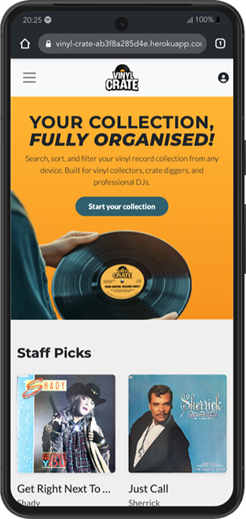
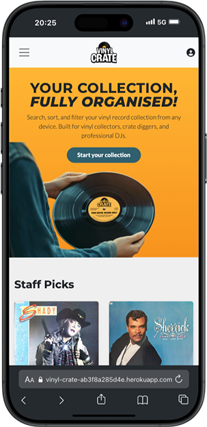
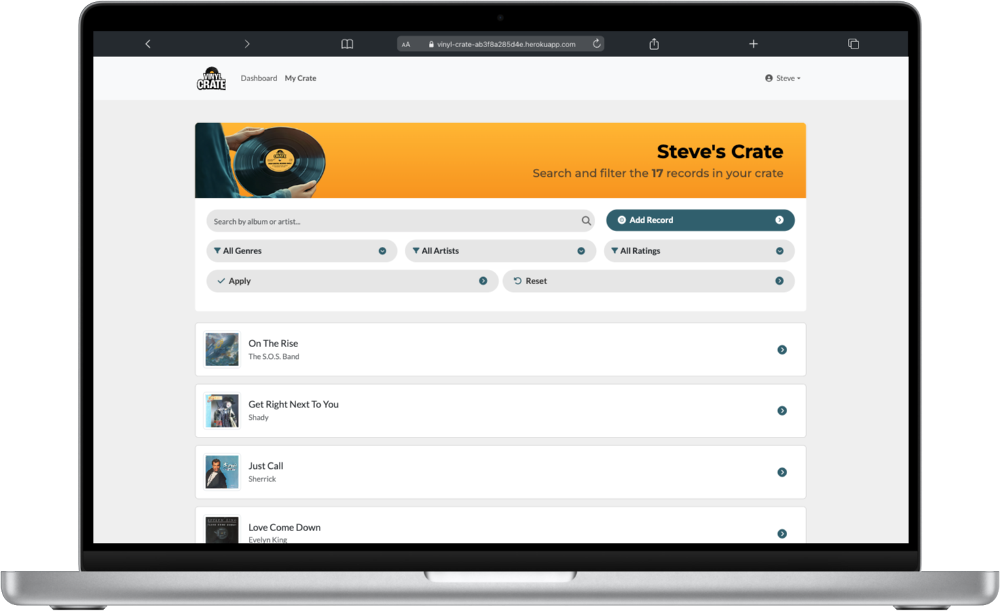
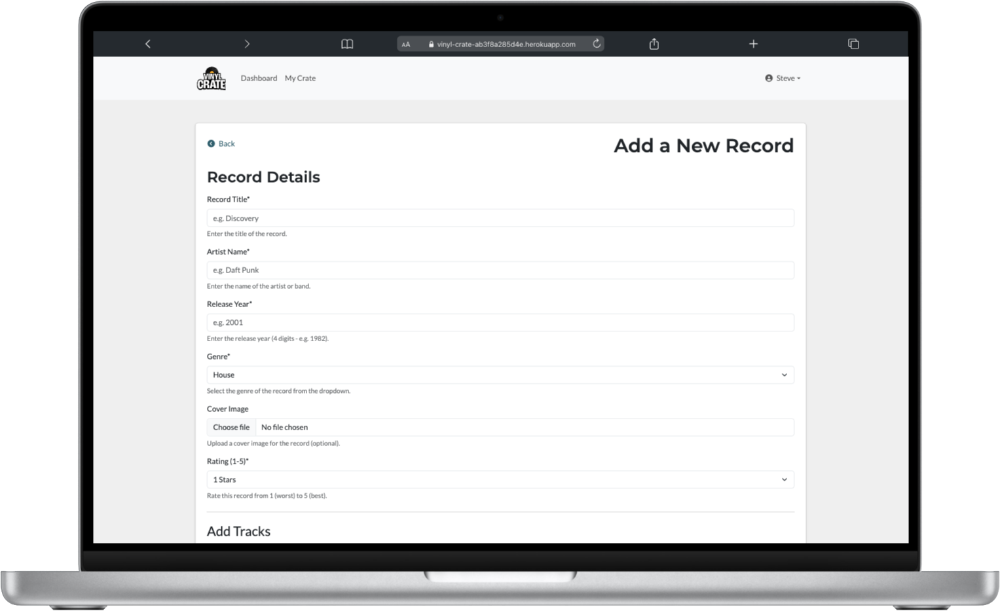

# Vinyl Crate - Testing

--

> [!NOTE]  
> Return back to the [README.md](README.md) file.

This document outlines the testing processes and results for the **Vinyl Crate** application. It ensures that all key features function correctly, provide a responsive and accessible user experience, and meet the expectations defined by the project requirements. Both manual and automated testing methods were used throughout the development process.

---

<a id=contents></a>

## CONTENTS

- [VALIDATION TESTING](#validation-testing)
  - [W3C Validator](#w3c-validation)
  - [W3C CSS Validator](#css-validation)
  - [JavaScript Validator](#js-validation)
  - [Python Validator](#python-validation)
  - [Lighthouse](#lighthouse)
- [AUTOMATED TESTING](#automated-testing)
- [MANUAL TESTING](#manual-testing)
  - [Full Testing](#full-testing)
  - [Browser Compatibility](#browser)
  - [Responsiveness](#responsiveness)
  - [Accessibility](#accessibility)
  - [Testing User Stories](#testing-user)
  - [Features Testing](#features-test)
  - [Existing Features](#existing-features)
  - [Manual Features Testing](#manual-features-test)
  - [Solved Issues & Bugs](#solved-issues)
  - [Known Issues & Bugs](#known-issues)

<br>
<hr>

Testing was an **integral part of the development process**, ensuring that the Vinyl Crate application remained both **functional and user-friendly** at every stage. Through **continuous testing**, issues were identified and resolved early, contributing to a smoother development workflow and a more reliable final product.

**Chrome Developer Tools** were used extensively to monitor page responsiveness, diagnose styling and layout issues, and debug JavaScript and form interactions. This allowed for efficient troubleshooting and performance tuning during both frontend and backend development.

**ChatGPT** was a key support resource throughout the project. It helped refine user flows, debug Django logic, structure testing strategies, and optimize content and interface decisions. The guidance received led to more maintainable code, better practices, and improved overall project quality.

To ensure the site was **responsive and accessible across devices**, all views and forms were manually tested on a range of screen sizes using Chrome’s responsive design mode, alongside physical testing on **desktops, laptops, tablets, and smartphones**. Special attention was given to form interactions, navigation flow, and data display across breakpoints to guarantee a **consistent user experience**.

---

<a id="validation-testing"></a>

## Validation Testing

<a id="w3c-validation"></a>

### W3C Validator

[W3C Validator](https://validator.w3.org/) was used to check the HTML and CSS across all pages of the site. Since Django’s templating language is embedded within the HTML files, I viewed the rendered page source in the browser and submitted that output to the validator to ensure accuracy.

| Page tested | Result | Evidence |
| --------- | ------ | ---------- |
| Home | Pass | [Home Page Validation](documentation/testing/validation/w3c-home.webp) |
| Dashboard | Pass | [Dashboard Page Validation](documentation/testing/validation/w3c-dashboard.webp) |
| My Crate  | Pass | [My Crate Page Validation](documentation/testing/validation/w3c-my-crate.webp) |
| Record Detail  | Pass | [Record Detail Page Validation](documentation/testing/validation/w3c-record-detail.webp) |
| 400  | Pass | [404 Page Validation](documentation/testing/validation/w3c-400.webp) |
| 403  | Pass | [404 Page Validation](documentation/testing/validation/w3c-403.webp) |
| 404  | Pass | [404 Page Validation](documentation/testing/validation/w3c-404.webp) |
| 500  | Pass | [500 Page Validation](documentation/testing/validation/w3c-500.webp) |

---

<a id="css-validation"></a>

### CSS Validator

[CSS W3C Validator](https://jigsaw.w3.org/css-validator/) was used to validate my CSS file.

| File tested | Result | Evidence |
| ----------- | ------ | -------- |
| base/style.css | Pass | [base/style.css validation](documentation/testing/validation/w3c-style-css.webp) |

---

<a id="js-validation"></a>

### JavaScript

All JavaScript was validated using [JSHint](https://jshint.com/) to ensure proper syntax, code quality, and adherence to best practices.

| File tested | Result | Evidence | Notes |
| ----------- | ------ | -------- | ----- |
| static/js/track_formset.js | Pass | [track_formset.js](documentation/testing/validation/javascript-track_formset.webp) | There were 17 initial warnings -  11 instances of `'const' is available in ES6 (use 'esversion: 6') or Mozilla JS extensions (use moz).` 3 instances of `'arrow function syntax (=>)' is only available in ES6 (use 'esversion: 6').` 3 instances of `'template literal syntax' is only available in ES6 (use 'esversion: 6').` JSHint is warning you that async functions are only supported in ES8 (ECMAScript 2017), but it is currently set to an older ECMAScript version. I updated the JSHint configuration to ES8 using this code `/*jshint esversion: 8 */`. |

---

<a id="python-validation"></a>

### Python Validator

All Python code was validated using the [Code Institute Python Linter](https://pep8ci.herokuapp.com/), which checks for compliance with PEP8 — the official Python style guide. This ensured consistent, readable, and well-structured code throughout the project.

| File | Result | Evidence |
| :--- | :--- | :---: |
| **VINYLCRATE_PROJECT** |
| records/asgi.py | Pass | [asgi.py validation](documentation/testing/validation/python-asgi.webp) |
| records/settings.py | Pass | [admin.py validation](documentation/testing/validation/python-settings.webp) |
| records/urls.py | Pass | [urls.py validation](documentation/testing/validation/python-project-urls.webp) |
| records/wsgi.py | Pass | [wsgi.py validation](documentation/testing/validation/python-wsgi.webp) |
| **RECORDS** |
| records/admin.py | Pass | [admin.py validation](documentation/testing/validation/python-admin.webp) |
| records/apps.py | Pass | [apps.py validation](documentation/testing/validation/python-apps.webp) |
| records/forms.py | Pass | [forms.py validation](documentation/testing/validation/python-forms.webp) |
| records/models.py | Pass | [models.py validation](documentation/testing/validation/python-models.webp) |
| records/urls.py | Pass | [urls.py validation](documentation/testing/validation/python-urls.webp) |
| records/views.py | Pass | [views.py validation](documentation/testing/validation/python-views.webp) |
| records/tests_admin.py | Pass | [tests_admin.py validation](documentation/testing/validation/python-tests_admin.webp) |
| records/tests_forms_signup.py | Pass | [tests_forms_signup.py validation](documentation/testing/validation/python-tests_forms_signup.webp) |
| records/tests_forms_track.py | Pass | [tests_forms_track.py validation](documentation/testing/validation/python-tests_forms_track.webp) |
| records/tests_forms_record.py | Pass | [tests_forms_record.py validation](documentation/testing/validation/python-tests_forms_record.webp) |
| records/tests_views.py | Pass | [tests_views.py validation](documentation/testing/validation/python-tests_views.webp) |

<a id=lighthouse></a>

### Lighthouse

I've tested my deployed project using the Lighthouse Audit tool to test the performance, accessibility, best practices and SEO of the website.

| Page | Mobile | Desktop | Notes |
| :--: | :--: | :--: | :--: |
| Home |  |  | ✅ Passed with great results |
| Record Detail |  |  | ✅ Passed with great results |
| 404 |  |  | ✅ Passed with great results |
| 500 |  |  | ✅ Passed with great results |

---

<a id="automated-testing"></a>

## Automated Testing

Automated testing was a critical part of the development process for **Vinyl Crate**, ensuring that key components of the application worked reliably across various user scenarios. The testing suite was designed to cover **models, forms, views, and admin methods** using Django’s built-in [TestCase](https://docs.djangoproject.com/en/4.1/topics/testing/overview/) framework, supported by [coverage](https://pypi.org/project/coverage/) for reporting.

### Scope of Automated Testing

The automated test suite was planned and executed to cover the following key areas:

#### Models
- **Record** and **Track** models
- Field definitions, validation constraints, default values, and foreign key relationships
- Basic model creation with valid and invalid data

#### Forms
- **RecordForm**, **TrackForm**, and **CustomSignupForm**
- Required field validation, custom error messages, widget rendering
- Optional vs required fields behaviour (e.g. blank BPM or musical key)
- Edge cases, such as rating and BPM outside allowed range, or invalid year input

#### Views
- Coverage of all major views:
  - `index`, `record_list`, `record_detail`
  - `record_create`, `record_update`, `record_delete`
  - `record_collection`, and `custom_404_view`
- GET and POST requests tested using `client.get()` and `client.post()`
- Authentication requirements enforced and verified
- Context data verified (e.g. record queryset, staff picks, filter options)
- Template rendering assertions using `assertTemplateUsed`

#### Admin
- `cover_thumb()` logic tested explicitly
- Ensures graceful fallback for records with missing or broken images
- Admin display robustness validated separately from frontend logic

#### User Flow
- Simulated signup flow using `CustomSignupForm`
- Verifies correct storage of first and last name fields
- Checks that optional fields do not block signup
- Error handling for missing username or password mismatches

#### Tools Used

| Tool | Purpose |
| ---- | ------- |
| Django TestCase | Core unit and integration test framework |
| Client() | Simulates authenticated and anonymous users |
| coverage.py | Measures line and branch coverage |
| htmlcov/ | Visual review of missed lines and test quality |

#### Test Files

| File Name | Contents | 
| ---- | ------- |
| tests_forms_record.py | RecordForm validation and required field logic |
| tests_forms_track.py | TrackForm validation, optional fields, and data types |
| tests_forms_signup.py | Signup logic and first/last name persistence |
| tests_views.py | All key views covered including CRUD and 404 |
| tests_admin.py | Admin thumbnail image rendering logic |

#### Coverage Testing

Testing was monitored using `coverage.py`, and line-by-line analysis was conducted to identify and address gaps. Areas typically hard to reach (like admin methods or error branches) were tested explicitly. Coverage reached a high level, with all business-critical logic tested and documented.

| Coverage for | Total | Evidence |
| ------------ | ----- | -------- |
| Records      | 96%   | [Coverage Records](documentation/testing/validation/coverage_records.webp) |

#### Edge Cases Covered
- Submitting forms with missing, invalid, or out-of-range data
- Submitting a record with no title (invalid)
- Filtering/searching records with multiple query params
- Authenticated vs unauthenticated access (e.g. attempting to view a record without login)
- Trying to update/delete records not owned by the user
- Rendering views with no records (empty states and onboarding)
- Handling missing or corrupted image files in the admin interface
- Custom 404 handling with missing templates and bad URLs

### Summary

This comprehensive automated test suite ensures that Vinyl Crate is robust, secure, and scalable. It gave confidence to iterate rapidly, knowing that regressions would be caught early in development.

--
<a id="manual-testing"></a>

## Manual Testing

<a id="full-testing"></a>

### Full Testing

This section outlines the **manual testing** process conducted to ensure the Vinyl Crate web application functions correctly across all major user interactions, devices, and screen sizes. Testing focused on form validation, navigation flows, responsiveness, and general usability. Each feature was tested systematically to identify potential issues related to layout, logic, or access control.

Additional feedback was gathered through informal testing by friends and family on a variety of devices and browsers to further validate the user experience and cross-device compatibility.

<a id=browser></a>

### Browser Compatibility

- [Safari](https://www.apple.com/uk/safari/)
- [Chrome](https://www.google.com/chrome)
- [Firefox](https://www.mozilla.org/firefox)
- [Bing](https://www.bing.com/)
- [Edge](https://www.microsoft.com/en-gb/edge?form=MA13FJ)

I tested my deployed project on multiple browsers to check for compatibility issues.

---

<a id=responsiveness></a>

### Responsiveness

In addition to testing my deployed site on different devices, I thoroughly tested its responsiveness using Chrome Developer Tools.  
I researched the **narrowest width of modern devices** on [Stack Exchange](https://ux.stackexchange.com/questions/74798/are-there-devices-narrower-than-320px-and-data-on-their-usage-for-web-browsing) and based my testing on **320px** as a standard minimum width.  
Additionally, I used the [Mobile First Plugin](https://www.webmobilefirst.com/en/), a Chrome extension designed to test site responsiveness across different devices.

#### Mobile Devices

| Device tested | Screen Width (px) | Screen Height (px) | Result | Notes (Issues Found) |
| :---: | :---: | :---: | :---: | :---: |
| iPhone 5  | iPhone 12/13/14  | Google Pixel 8  | iPhone 16 Pro Max  |
| iPhone 5 | 320px | 568px | ✅ Pass | 🛠️ Removed background image and filled screen with panel |
| iPhone 12/13/14 | 390px | 844px | ✅ Pass | 🛠️ Set info panel to hidden when other panels are visible |
| Google Pixel 8 | 412px | 916px | ✅ Pass | 🛠️ Set info panel to hidden when other panels are visible |
| iPhone 16 Pro Max | 440px | 956px | ✅ Pass | 🛠️ Set info panel to hidden when other panels are visible |

#### Tablets

| Device tested | Screen Width (px) | Screen Height (px) | Result | Notes (Issues Found) |
| :---: | :---: | :---: | :---: | :---: |
| iPad Mini  | Galaxy Tab S7  | iPad Pro 11  | | |
| iPad Mini | 768px | 1024px | ✅ Pass | 🛠️ Decreased margin spacing to improve UI |
| Galaxy Tab S7 | 800px | 1280px | ✅ Pass | 🛠️ Decreased margin spacing to improve UI |
| iPad Pro 11 | 834px | 1194px | ✅ Pass | 🛠️ Decreased margin spacing to improve UI |

#### Laptops & Desktops

| Device tested | Screen Width (px) | Screen Height (px) | Result | Notes (Issues Found) |
| :---: | :---: | :---: | :---: | :---: |
| MacBook Air 13”  | Dell Latitude  | Macbook Pro 16"  | iMac 24"  | Full HD monitor  |
| MacBook Air 13” | 1280px | 800px | ✅ Pass | ✅ Fully responsive |
| Dell Latitude | 1440px | 809px | ✅ Pass | ✅ Fully responsive |
| Macbook Pro 16" | 1728px | 1085px | ✅ Pass | ✅ Fully responsive |
| iMac 24" | 2048px | 1142px | ✅ Pass | ✅ Fully responsive |
| Full HD monitor | 1920px  | 1080px | ✅ Pass | ✅ Fully responsive |

---

<a id=accessibility></a>

### Accessibility

#### Colour contrast compliance

In addition to the automated tests for accessibility standards, I used [WebAIM](https://webaim.org/resources/contrastchecker/) to test the contrast of the colours on the site for visually impaired users.

| Foreground colour | Background colour | Screenshot | Testing results |
| :-----------------: | :-----------------: | :---------------: | :---------------: |
| `#ffffff`         | `#252733`         | | ✅ Pass |
| `#151724`         | `#4f9aff`         | | ⛔️ Fail on small text <br> ✅  Pass on larger text and graphics |
| `#4eb738`         | `#252733`         | | ⛔️ Fail on small text <br> ✅  Pass on larger text and graphics |
| `#e83c5a`         | `#252733`         | | ⛔️ Fail on all text <br> ✅  Pass on graphics |
| `#f59527`         | `#252733`         | | ⛔️ Fail on small text <br> ✅  Pass on larger text and graphics |

---

---

### Testing User Stories

| User Story ID | As a/an      | I want to be able to ...                            | So that I can...                                         | How is this achieved? | Evidence |
|---------------|--------------|------------------------------------------------------|----------------------------------------------------------|------------------------|----------|
| **Viewing and Navigation** | | | | | |
| 1             | New Visitor  | Browse a public record or staff-picked collection    | See what the site is about before registering            | The homepage features a staff picks section with six records marked as staff picks in the admin panel, all publicly viewable without login. Unauthenticated users can click these entries to view full metadata, cover art, and track listings using the record_detail view, giving a sense of the app’s purpose and design before registering. | [Staff Picks Section](documentation/testing/user-story-testing/testing-staffpicks.gif) |
| 2             | New Visitor  | View example record entries with metadata            | Understand how records are displayed and organised       | Public staff-picked records on the homepage link to detailed record pages rendered by the `record_detail` view. Each page displays full metadata including artist, title, genre, rating, release year, and cover image. If tracks are included, they are listed with optional BPM, key, and duration fields. This allows visitors to preview how records are structured and organised before signing up. | [Example Record Entries](documentation/testing/user-story-testing/testing-examples.gif) |
| 9             | User         | View full details for a single record                | See all metadata and visuals in one place                | Each record in the user’s collection or the public staff-pick section links to a dedicated detail page (`record_detail` view). This page displays all metadata fields submitted through the form — including artist, title, genre, rating, release year, label, and notes — along with a cover image and a full tracklist table showing track name, BPM, musical key, and duration (if available). The layout is mobile-responsive and styled for clear presentation. | [Record Details View](documentation/testing/user-story-testing/testing-details.webp) |
| 23            | Mobile User  | Access my collection on a phone or tablet            | View or update records while crate digging or DJing      | **Vinyl Crate** is built using responsive design principles and tested across multiple mobile and tablet devices using Chrome DevTools and physical devices. All views — including the dashboard, record detail pages, and add/edit forms — adjust layout and font sizes to suit smaller screens. Navigation menus adapt using a mobile-friendly hamburger menu, ensuring users can access, view, and update their collection on the go with full functionality. | [Mobile View Example](documentation/testing/user-story-testing/testing-mobile.gif) |
| 24            | Mobile User  | Upload cover images from my device                   | Add new records quickly without needing a computer       | The Add Record form supports image uploads via mobile devices using the `<input type="file">` field. Users can select a photo from their phone’s gallery or take one directly using their camera. The form has been tested on mobile browsers to ensure file inputs work correctly and integrate seamlessly with Cloudinary, which stores and serves uploaded images responsively. | [Mobile Upload Example](documentation/testing/user-story-testing/testing-upload.gif) |
| **Registration and user accounts** | | | | | |
| 3  | New Visitor | See a clear sign-up or log-in prompt | Know how to get started | The homepage and navigation bar include prominent **“Sign Up”** and **“Log In”** buttons, using `allauth` templates. Unauthenticated users are prompted to log in when attempting to access restricted pages. | [Signup Prompt](documentation/testing/user-story-testing/testing-signup-prompt.webp) |
| 4  | User        | Register and log in                   | Access my personal dashboard and collection | Registration and authentication use **Django Allauth**, allowing users to securely register, log in, and log out. On successful login, users are redirected to their personal dashboard view (`record_list`). | [Login Flow](documentation/testing/user-story-testing/testing-login.gif) |
| 14 | User        | Recover my password                   | Regain access if I forget my login details | A **password reset** link is available on the login page via `allauth`. Users receive an email to reset their password securely. | [Password Reset](documentation/testing/user-story-testing/testing-password-reset.webp) |
| 15 | User | Edit my account profile | Update my display name, location, or bio | ❌ This feature was **not implemented in this release**. User profiles default to the data provided during registration. A profile update form was considered but de-prioritised in favour of core collection features. | ⛔ Not implemented |
| 16 | User        | Sign in via social media (optional)   | Log in more quickly or conveniently | ❌ Not implemented. Social authentication (e.g. Google, GitHub) was considered but **excluded from this release** to focus on core features. May be included in a future enhancement. | ⛔ Not implemented |
| **Sorting and searching** | | | | | |
| 5             | User    | Add new records to my collection                | Keep an up-to-date log of the vinyl I own              | Authenticated users can access the “Add Record” form from their dashboard. Each record can include title, artist, year, genre, rating, and a cover image. Submissions are saved to the database and displayed in the user’s personal collection. | [Add Record](documentation/testing/user-story-testing/testing-add-record.gif) |
| 6             | User    | Upload a cover image for a record               | Make my collection visually rich                       | The record form includes an image field allowing uploads via Cloudinary. Uploaded cover images are displayed across dashboard views, record details, and the admin panel. | [Upload Cover](documentation/testing/user-story-testing/testing-upload-cover.gif) |
| 7             | User    | Edit existing records                           | Correct mistakes or update metadata                    | A record’s detail page includes an “Edit” button visible to its owner. The pre-filled form allows changes to fields like genre, year, or rating. Submitting updates the entry in the database. | [Edit Record](documentation/testing/user-story-testing/testing-edit-record.gif) |
| 8             | User    | Delete a record from my collection              | Keep my library clean and relevant                     | A user can click “Delete” on their own records, triggering a confirmation prompt before permanently removing the record from the database. | [Delete Record](documentation/testing/user-story-testing/testing-delete-record.gif) |
| 10            | User    | Sort and filter my collection                   | Quickly find records by genre, BPM, or rating          | The “My Crate” page includes dropdown filters and sort controls. Users can filter records by genre or rating, or sort by artist, BPM, or title using JavaScript and Django querysets. | [Filter Records](documentation/testing/user-story-testing/testing-filter-records.gif) |
| 11            | User    | Search for a specific record                    | Find entries fast without scrolling                    | A search bar allows users to search their collection by keyword (e.g., artist, title, or genre). Django query logic returns relevant matches dynamically. | [Search Collection](documentation/testing/user-story-testing/testing-search-records.gif) |
| 12            | User    | Rate a record using 1–5 stars                   | Track how much I value or enjoy a record               | The record form and edit page allow users to assign a 1–5 star rating. This rating is stored in the database and displayed alongside cover art and metadata in collection views. | [Rating Display](documentation/testing/user-story-testing/testing-rating-stars.gif) |
| 13 | User | Export my collection as a CSV | Back it up or use it in another system | This feature is **planned for a future release**. The export functionality was considered during development, but deferred to prioritise core CRUD and filtering features for this MVP. | ⛔ Not implemented |
| 17            | User    | Add individual tracks to each record            | Log full tracklists for more detailed entries          | The record form includes a dynamic inline formset for adding multiple track entries. Each track includes title, BPM, key, and duration. Tracks are saved as related objects. | [Add Tracks](documentation/testing/user-story-testing/testing-add-tracks.gif) |
| 18            | User    | Include BPM, key, and duration for each track   | Help with DJing or playlist curation                   | Each track in a record allows input of BPM, musical key, and duration. These are displayed on the record detail page and are useful for sorting or crate digging. | [Track Metadata](documentation/testing/user-story-testing/testing-track-metadata.gif) |
| **Administration** | | | | | |        
| 19            | Admin   | Access the Django admin panel                 | Manage users and records directly           | The Django admin panel is enabled and secured behind authentication. Superusers created via the Django shell or `createsuperuser` command can access `/admin/` to manage all site models. | [Admin Panel Access](documentation/testing/user-story-testing/testing-adminpanel.webp) |
| 20            | Admin   | Edit or delete any record in the system       | Support users and maintain database integrity | From the admin panel, administrators can view, add, edit, and delete `User`, `Record`, and `Track` entries. Permissions are restricted so that only authenticated staff users can perform these actions. | [Admin Record Edit](documentation/testing/user-story-testing/testing-admin-edit.gif) |
| 21            | Admin   | Review user-submitted content                   | Ensure the platform remains clean and appropriate      | Admin users can browse the full database of records submitted by users via the Django admin panel. From there, entries can be reviewed for appropriateness, edited if needed, or removed entirely. Staff-only access ensures moderation control. | [Admin Review](documentation/testing/user-story-testing/testing-admin-review.gif) |
| 22            | Admin   | Manage tracks directly from the Record admin view | Save time editing metadata without switching models     | An inline formset is configured in the Django admin so that related `Track` entries can be viewed and managed directly from the `Record` admin page. This streamlines editing without needing to open each track individually. | [Inline Track Editing](documentation/testing/user-story-testing/testing-admin-track.gif) |

> [!NOTE]
> User stories can also be viewed in the [README](README.md) file.

## Features Testing

### Home Page

#### Overview  
The **Home Page** serves as the landing screen for Vinyl Crate, introducing users to the purpose of the app and encouraging them to sign up. It’s designed to make a strong first impression and provide clear, immediate pathways for new and returning users.  

Both **unauthenticated visitors** and **logged-in users** see the same homepage layout, but the **navigation bar adapts dynamically**. Non-registered users see **“Login”** and **“Register”** links, while authenticated users are shown links to their **Dashboard**, **My Crate**, and a **user dropdown** with their name and logout option.

---

**Features Tested**

**Introduction & Engagement**  
- The carousel headline and description clearly communicate the app’s core benefit: organising and exploring a vinyl collection.  
- Text is styled responsively and uses semantic HTML for readability across devices.  
- Imagery complements the theme, displaying a vinyl-related graphic alongside the message.  

**Navigation & Call to Action**  
- The **“Start your collection”** call-to-action button leads to the registration page (`/accounts/signup/`).  
- The navigation bar dynamically updates based on user authentication state.  
- ARIA labels and button roles are used to support screen readers and improve accessibility.  

**Branding & Design**  
- Consistent branding is maintained throughout the page, including logo, typography, and colour scheme.  
- The layout features a centered carousel with alternating content and imagery for a balanced visual experience.  
- Carousel controls and indicators offer interactive navigation between promotional slides.  

**Responsiveness & Accessibility**  
- The homepage is fully responsive, tested across mobile, tablet, and desktop breakpoints.  
- Buttons, links, and carousel indicators are keyboard-navigable.  
- Semantic HTML elements (`<h1>`, `<p>`, `<a>`, `<button>`) are used to enhance accessibility.  

**Performance & Functionality**  
- The homepage loads quickly with optimised assets.  
- Carousel transitions are smooth and include accessible labels.  
- Navigation elements (e.g., login/register or dashboard links) behave correctly depending on authentication status.

<details>
<summary>Click here to see the Home Page</summary>


</details>
<br>
<hr>

### Dashboard

#### Overview  
The **Dashboard** serves as the personalised entry point for authenticated users of Vinyl Crate. It greets the user by name and summarises the current size of their record collection. The page adapts dynamically based on whether or not the user has added any records, helping provide a tailored experience for both new and returning users.

---

**Features Tested**

**Welcome & Personalisation**  
- Displays a welcome message using the user's first name (or username fallback) and shows a count of how many records they currently own.  
- Provides two large buttons:  
  - **“View Crate”** leads to the full collection (`record_collection`).  
  - **“Add Record”** directs users to the form for creating a new record (`record_create`).  
- Action buttons are styled for accessibility and screen-reader navigation.

**Recently Added Section (for returning users)**  
- If the user has records, up to **eight recently added records** are shown in a responsive grid.  
- Each record includes:
  - Album artwork (or a placeholder if none uploaded)
  - Title and artist name
  - Link to the individual record detail page
- Includes a **“View All”** link to the full record collection.
- A final “Add Record” tile is shown as a call-to-action.

**Empty State (for new users)**  
- If the user has not yet added any records, they are shown:
  - A prominent **“Add Record”** quick tile.  
  - Below this, the **Staff Picks** section reappears to inspire users and reinforce how collections appear once populated.  

**Staff Picks Section (fallback display)**  
- Shown below the quick-add tile when the user's collection is empty.  
- Reuses the public-facing staff-picked records with images, titles, and artist links.  
- Clicking any staff pick opens its full detail view.

**Branding & Design**  
- Maintains consistent colour scheme and branding across all dashboard elements.  
- Uses cards, spacing, and large CTAs to create a user-friendly and visually appealing layout.  

**Responsiveness & Accessibility**  
- Fully responsive: layout adapts seamlessly across desktop, tablet, and mobile views.  
- All interactive elements include ARIA labels and keyboard navigability.  
- Semantic HTML ensures screen readers can correctly interpret the page structure.

**Performance & Functionality**  
- Dashboard content renders quickly and dynamically based on record presence.  
- No broken images or links, including fallback states for missing cover artwork.  
- Navigational elements behave as expected, and transitions between actions (add/view) are smooth.

<details>
<summary>Click here to see the Dashboard</summary>


</details>
<br>
<hr>

### My Crate page

#### Overview  
**My Crate** offers logged-in users an interactive overview of their personal record collection. It enables searching, filtering, and browsing their records with an emphasis on usability, clarity, and responsive layout. Whether the user owns 1 or 100 records, this page helps them efficiently explore their vinyl archive.

---

**Features Tested**

**Page Introduction & User Summary**  
- Displays a personalised headline using the user’s first name or username fallback.
- Shows a dynamic count of the records in the user’s crate.
- Background image enhances visual engagement without distracting from functionality.

**Search and Filter Functionality**  
- A **search bar** allows users to search by album or artist.
- Dropdown filters enable refined browsing:
  - **Genre**: populated from available genres.
  - **Artist**: auto-populated from user’s existing collection.
  - **Rating**: allows filtering by 1–5 stars.
- Form submission triggers updated display based on search and filter terms.
- **Apply** and **Reset** buttons support user control over filters.
- All form inputs use ARIA labels and appropriate input types for accessibility.

**Add Record Shortcut**  
- A clear and accessible **“Add Record”** button links to the `record_create` form view.
- Styled with icon and rounded-pill design for visual hierarchy and mobile usability.

**Record List Display**  
- Records are listed in a scrollable card format with consistent styling.
- Each card includes:
  - Thumbnail image (or fallback block if no image)
  - Title and artist
  - Chevron icon to indicate interactivity
- Clicking a card navigates to the **Record Detail** page.
- Cards are fully keyboard- and screen-reader accessible.

**Empty State**  
- If no records match the filters/search, a friendly message encourages users to adjust terms.
- Provides a non-broken layout and keeps user confidence intact.

**Branding & Design**  
- Visual elements are consistent with the rest of the app, using:
  - Clean typography
  - Rounded buttons
  - Subtle drop shadows
  - Colour-coded filters
- Consistent design improves user orientation and trust.

**Responsiveness & Accessibility**  
- Fully responsive layout adapts across mobile, tablet, and desktop.
- Filter forms collapse neatly on mobile.
- Focus indicators and labelled controls improve usability for keyboard users.
- Semantic HTML elements used throughout (e.g. `<form>`, `<section>`, `<button>`, `<label>`).

**Performance & Functionality**  
- Search and filter updates are handled server-side via GET parameters.
- Record display loads efficiently, including thumbnails via Cloudinary.
- URL state reflects filter/search context for deep linking and bookmarking.

<details>
<summary>Click here to see the My Crate page</summary>



</details>
<br>
<hr>

### Record Detail Page

#### Overview  
The **Record Detail Page** provides a visually rich and informative view of a single record in the user's collection. It includes album metadata, a full track listing, and user-specific actions such as editing or deleting the entry. This page is available to both anonymous (through Staff Picks) and authenticated users, though only the record owner can modify or remove the record.

---

**Features Tested**

**Hero Section & Visual Layout**  
- A large **background image** uses the record's cover art to create visual impact.
- A compact **info box** overlays the hero image, displaying the record’s title and artist alongside a thumbnail version of the cover.
- A **back button** is shown in the top left, returning the user to the previous page using the `previous_url` context variable.

**Metadata Display**  
- Record genre, year, and star rating are displayed in **separate styled boxes**.
- Rating is visualised with filled and unfilled FontAwesome star icons based on the numeric value.
- Layout adjusts cleanly across screen sizes (stacked on mobile, inline on desktop).

**Tracklist Section**  
- Each track is listed with its **position**, **title**, and **duration**.
- If available, **BPM** and **musical key** are shown below the track name in a muted style.
- Tracks are displayed in a vertically scrollable, accessible list format.
- If no tracks are present, a fallback message `No tracks added yet.` is shown.

**Record Action Buttons**  
- If the authenticated user **owns** the record, two buttons appear:
  - **Edit**: Navigates to the `record_update` view.
  - **Delete**: Navigates to the `record_delete` view.
- Buttons include icons and descriptive `aria-labels` for accessibility.
- Users cannot modify records they do not own (buttons are hidden).

**Branding & Design**  
- Consistent use of site styling: buttons, rounded boxes, and typographic scale.
- Colours and layout reinforce Vinyl Crate’s clean and functional brand.

**Responsiveness & Accessibility**  
- Page adjusts gracefully for mobile, tablet, and desktop views.
- Semantic HTML and proper label usage support screen reader accessibility.
- Interactive elements are keyboard-navigable and labelled appropriately.

**Performance & Functionality**  
- Cover images load via Cloudinary and are optimized with caching.
- Record data is safely passed via context and avoids errors if content is missing.
- Page renders quickly and remains usable even with large tracklists or missing fields.

<details>
<summary>Click here to see the Record Detail page</summary>


</details>
<br>
<hr>

### Record Create Page

#### Overview  
The **Record Create Page** allows authenticated users to add new vinyl records to their personal collection. It features a structured form for record-level metadata and an inline formset for adding individual track entries. The layout uses Django’s crispy forms for styling and integrates with custom JavaScript to support dynamic track addition.

---

**Features Tested**

**Header & Navigation**  
- A **Back button** allows users to return to the dashboard (`record_list` view).
- Page title dynamically updates to "Add a New Record" or "Edit Record" based on whether a new or existing entry is being edited.

**Record Form**  
- The form captures key metadata about the record, including:
  - `Title` and `Artist` with whitespace validation.
  - `Year` with a 4-digit integer limit (1000–9999).
  - `Genre` from a pre-defined choice set.
  - Optional `Cover Image` upload.
  - `Rating` from 1 to 5 stars.
- All inputs are styled using custom Bootstrap widgets.
- Validation errors are clearly displayed with custom error messages.

**Track Formset (Inline Form)**  
- Supports multiple track entries using Django's `inlineformset_factory`.
- Each track captures:
  - `Title`, `Position`, and `Duration` (with strict format validation).
  - Optional `BPM` (numeric) and `Musical Key`.
- Tracks can be **dynamically added** using the "Add a Track" button.
- Each added track form has a **remove button**, styled with a close icon.
- If no tracks exist yet, a message is displayed for context.

**Dynamic Track Handling**  
- A hidden `empty-form-template` is used to clone new blank track forms via JavaScript.
- Formset uses Django's management form to handle total form count during submission.

**Form Buttons**  
- `Cancel` button returns the user to the dashboard without submitting.
- `Add Record` or `Update` button submits the form to create or update the entry.
- All buttons are styled for clarity and accessibility.

**Branding & Design**  
- Uses a clean, card-based layout with subtle shadows and spacing.
- Form fields are grouped into logical sections for usability.
- Consistent use of rounded corners, button icons, and pill shapes.

**Responsiveness & Accessibility**  
- Page and form layout adapt well to mobile, tablet, and desktop breakpoints.
- Inputs, buttons, and formset fields are keyboard-accessible and labelled semantically.
- `aria-label` attributes enhance screen reader usability for all interactive elements.

**Performance & Functionality**  
- Form uses CSRF protection and server-side validation.
- Dynamic client-side track addition works without full-page reload.
- Edge cases such as empty fields, invalid duration formats, or excessively long input are gracefully handled.

<details>
<summary>Click here to see the Record Create page</summary>



</details>
<br>
<hr>

### Record Update Page

#### Overview  
The **Record Update Page** allows users to edit an existing record and its associated tracks. This page uses the same form and layout as the Create page but is pre-populated with the current record's data. It ensures users can manage and maintain accurate metadata in their personal vinyl collection.

---

**Features Tested**

**Access & Authorization**
- Only authenticated users who own the record can access the page.
- Unauthorized access attempts are blocked with a 404 error if the record doesn't belong to the user.

**Prefilled Record Form**
- The record form loads with all current values:
  - Title, Artist, Year, Genre, Cover Image, Rating.
- Fields can be updated and validated similarly to the Create form.
- Server-side validation ensures data integrity.

**Editable Track Formset**
- All previously entered tracks are displayed in the formset.
- Users can update:
  - Track title, position, duration, BPM, and musical key.
- The formset is rendered with `extra=0` to avoid unnecessary empty forms.
- Validation rules are enforced (e.g. valid duration format, BPM range).

**Form Submission Handling**
- On `POST`, both the record form and track formset are validated.
- If valid:
  - Updated data is saved to the database.
  - A success message is shown via Django’s `messages` framework.
  - The user is redirected to the record list (`record_list`).
- If invalid:
  - The form re-renders with error messages and retained user input.

**Layout & Reuse**
- The page reuses the `record_form.html` template, ensuring consistent design.
- The page title updates dynamically to **"Edit Record"**.
- An inline Back button allows users to return to their dashboard.

**Responsiveness & Accessibility**
- Forms are responsive across all screen sizes.
- Button and form field accessibility features (e.g. `aria-labels`, labels) are preserved from the Create page.

**Error Handling**
- If a user attempts to access a record they do not own, a `404 Not Found` is returned instead of exposing unauthorized data.
- Inline error messages appear next to fields when validation fails.

**Performance & Feedback**
- Uses Django’s message framework to confirm success with a toast-style alert.
- File uploads (e.g. cover image) are handled efficiently without unnecessary reloads.

<details>
<summary>Click here to see the Record Update page</summary>


</details>
<br>
<hr>

### Record Delete Page

#### Overview  
The **Record Delete Page** allows authenticated users to permanently remove a record from their collection. This action is protected by a confirmation prompt and limited strictly to the record’s owner. It ensures data cannot be deleted accidentally or by unauthorized users.

---

**Features Tested**

**Access & Permissions**
- Only the record’s owner can access the delete page.
- Any attempt to access another user's record for deletion returns a 404 error.
- Page is protected with the `@login_required` decorator.

**Delete Confirmation Prompt**
- Page displays a confirmation message with:
  - The record’s title and artist.
  - A thumbnail of the cover image (if uploaded).
- This ensures users can visually confirm the correct record before deletion.

**Form Submission (POST)**
- If the user confirms:
  - The record is deleted from the database.
  - A success message is shown using Django’s `messages` framework.
  - The user is redirected to the record list (`record_list`) for a smooth workflow.

**Cancel Option**
- The **Cancel** button links back to the individual record’s detail page.
- Ensures users can safely exit the delete process without making changes.

**CSRF Protection**
- The form includes a CSRF token to protect against cross-site request forgery attacks.

**UI & Accessibility**
- Clear visual hierarchy with the danger icon and heading:  
  `<i class="fa-solid fa-circle-exclamation"></i> Confirm Deletion`
- Buttons have appropriate visual contrast and semantic labels.
- Responsive design: layout adjusts on mobile and tablet screens.

**Validation & Error Handling**
- Invalid requests (wrong user, non-existent record) return a 404 error.
- If deletion is successful, the user receives immediate feedback.
- If the user reloads after deletion, they're redirected safely away from a broken view.

**Performance**
- Fast loading confirmation screen.
- Deletion is instant with minimal user disruption.

<details>
<summary>Click here to see the Record Delete page</summary>


</details>
<br>
<hr>

### Authentication Pages

#### Overview  
Authentication features in Vinyl Crate are powered by **Django Allauth**, offering users a secure and intuitive way to register, log in, and manage their accounts. The system supports form validation, error feedback, and accessibility features throughout the process.

---

**Features Tested**

** Login Page**
- URL: `/accounts/login/`
- Users can log in using their **email** and **password**.
- Form validation triggers errors for:
  - Blank fields
  - Incorrect credentials
- If login is successful:
  - User is redirected to their **dashboard**.
  - Navbar updates to show **Dashboard**, **My Crate**, and user icon.
- If login fails:
  - Error message is shown without losing form input.
- “Forgot password?” link correctly navigates to password reset page.

** Register Page**
- URL: `/accounts/signup/`
- Users can sign up by providing:
  - First name
  - Last name
  - Email
  - Password (twice for confirmation)
- Form is validated for:
  - Required fields
  - Password mismatch
  - Email format
- On success:
  - Account is created and user is logged in automatically.
  - Redirect to dashboard occurs with welcome message.
- On error:
  - Helpful error messages are displayed inline.
  - Fields with issues are highlighted.

** Logout**
- Accessible from user dropdown (top right of navbar) when logged in.
- Logs the user out and redirects to the **home page**.
- A toast message confirms successful logout.

** Password Reset**
- URL: `/accounts/password/reset/`
- Users enter their email to receive a reset link.
- Valid email:
  - Redirects to a confirmation page.
  - Email is sent with secure reset link (mocked in testing).
- Invalid or unregistered email:
  - Still triggers confirmation page (no information leakage).
- Reset process includes:
  - Secure token validation
  - Form to set a new password
  - Confirmation screen on success

---

#### Accessibility & UI
- All forms include:
  - Proper `<label>` and `aria` attributes
  - Clear focus states and accessible error feedback
- Responsive layout works on mobile, tablet, and desktop.
- Button text and input labels are descriptive and consistent.

---

#### Security Notes
- All pages are CSRF-protected.
- Passwords are never shown in plain text.
- Rate limiting is handled by Allauth/Django under default middleware.

---

<details>
<summary>Click here to see the Authentication pages</summary>

<summary>Login page</summary>


<summary>Register page</summary>


<summary>Logout page</summary>


<summary>Password reset page</summary>


</details>
<br>
<hr>

### Admin Panel

#### Overview  
The Django admin interface for Vinyl Crate has been customized to streamline backend record and track management. This includes visual improvements, inline editing of related models, and branded layout via a custom `base_site.html`.

---

#### Features Tested

**Custom Branding (base_site.html)**
- The admin interface uses a custom template extending `admin/base.html`.
- The `<title>` is customized to show:  
  `{{ subtitle }} | {{ title }} | Vinyl Crate Admin`
- The site name header links back to the admin index and reads:  
  `Vinyl Crate Admin`
- The global navigation bar is disabled for a clean, focused UI.

✅ Branding displays correctly on all admin pages  
✅ Template correctly overrides the default Django admin appearance

---

**Record Model Admin**
- Records appear in the admin list with custom fields:
  - `title`, `artist`, `user`, `genre`, `year`, `rating`
  - `is_staff_pick` (shows True/False)
  - `cover_thumb` – displays thumbnail preview
- Admin filters:
  - Genre, Rating, Year, and Staff Pick
- Search field supports:
  - Record title
  - Artist name
  - Username of record owner
- `slug` is excluded from form view to reduce clutter
- `cover_thumb` is read-only to prevent editing but aids quick visual identification

✅ Cover image thumbnail displays with fallback logic  
✅ Admin filtering and search return correct results  
✅ Fields are organized for clarity and editing is intuitive

---

**Inline Tracks (TrackInline)**
- Admin users can view and manage a record’s tracks **inline** on the Record admin page.
- Track fields included:
  - `position`, `title`, `duration`, `bpm`, and `key`
- Minimum of one extra blank row provided to encourage additional track input

✅ Track inlines appear correctly within Record admin  
✅ Existing tracks are editable inline  
✅ New tracks can be added without switching pages  
✅ BPM and key fields handle optional input as expected

---

**Track Model Admin**
- Tracks can be managed as standalone entries
- List display includes:
  - `title`, `record`, `position`, `duration`, `bpm`, `key`
- Filters:
  - Key and BPM
- Searchable by:
  - Track title
  - Associated record title and artist

✅ Standalone track management behaves as expected  
✅ Linking back to associated records works smoothly

---

#### Accessibility & Usability
- All admin forms follow Django admin standards for accessibility
- Thumbnail images have descriptive `alt` text fallback if needed
- Inline forms are fully keyboard-navigable

---

#### Security & Permissions
- Only authenticated **superusers** can access `/admin/`
- Admin views are protected with CSRF tokens and staff-only access

---

<details>
<summary>Click here to see the Admin Panel</summary>


</details>
<br>
<hr>

### Error Pages

#### Overview  
Vinyl Crate includes four fully customized error pages to handle unexpected user behavior and server-side issues. These templates ensure that even when something goes wrong, the user experience remains informative, friendly, and visually consistent with the rest of the site.

Each page is styled with Bootstrap and includes a unique SVG image, helpful messaging, and a call-to-action button linking back to the homepage.

---

**Features Tested**

**Shared Features**
- All pages extend the `base.html` template for consistent layout and styling.
- Each page displays:
  - A distinct heading and supporting message
  - A themed SVG illustration (e.g., `400-error.svg`, `404-error.svg`)
  - A prominent return button:  
    **`<a href="/"> Return to Home </a>`**
- Pages are mobile-responsive and accessible, using appropriate ARIA labels and semantic headings.

✅ Styling and layout match the rest of the site  
✅ Accessible structure: `<h1>`, `<p>`, and focusable buttons  
✅ All pages are reachable by triggering the relevant status code

---

**400 – Bad Request**
- Triggered when the client sends a malformed request.
- Message: "Something went wrong with the request."
- Example triggers: manually editing URLs, submitting broken forms

**403 – Forbidden**
- Shown when a user tries to access a restricted page (e.g., editing another user's record).
- Message: "You don’t have permission to view this page."

**404 – Page Not Found**
- Default fallback when a user navigates to a non-existent route.
- Message: "We couldn’t find the page you were looking for."

**500 – Server Error**
- Catches server-side issues or unexpected backend failures.
- Message: "The server encountered an error."

✅ Each error page uses a relevant image and message  
✅ Homepage button always returns the user to safety  
✅ Status codes handled by Django using `handlerXXX` settings in `urls.py`

---

#### Technical Setup

- Custom error handlers registered in `vinylcrate_project/urls.py`:
  ```python
  handler404 = record_views.custom_404_view
  handler500 = "django.views.defaults.server_error"
  handler403 = "records.views.custom_403_view"
  handler400 = record_views.custom_400_view
  ```

<details>
<summary>Click here to see the Error pages</summary>

<summary>400 page</summary>


<summary>403 page</summary>


<summary>404 page</summary>


<summary>500 page</summary>


</details>
<br>
<hr>

## Manual Features Testing

### Navbar (Header) - (`base.html`)

| Feature | Expected Outcome | Testing Performed | Result | Pass/Fail |
|--------|------------------|-------------------|--------|-----------|
| **Vinyl Crate** Logo (mobile & desktop) | Clicking the **Vinyl Crate** logo navigates to home page (`/`) | Clicked the **Vinyl Crate** logo | The home page was shown | ✅ Pass |
| **Login** link | Navigates to `/accounts/login/` | Clicked on the **Login** link | Navigated to `/accounts/login/` | ✅ Pass |
| **Register** link | Navigates to `/accounts/signup/` | Clicked on the **Register** link | Navigated to `/accounts/signup/` | ✅ Pass |

### Homepage Content (Public) - (`index.html`)

| Feature | Expected Outcome | Testing Performed | Result | Pass/Fail |
|--------|------------------|-------------------|--------|-----------|
| **Start your collection** CTA Button | Navigates to `/accounts/signup/` | Clicked on the **Start your collection** button | Navigated to `/accounts/signup/` | ✅ Pass |
| Carousel controls: Previous button | Click scrolls to previous slide | | | |
| Carousel controls: Next button | Click scrolls to next slide | | | |
| Carousel indicators (dots) | Clicking each dot navigates to correct slide | | | |
| **Staff Picks** Record links | Clicking on each of the 6 **Staff Picks** record covers navigates to their record detail pages | Clicked on each of the Staff Picks covers | Navigated to each of their record detail pages | ✅ Pass |

### Footer - (`base.html`)

| Feature | Expected Outcome | Testing Performed | Result | Pass/Fail |
|--------|------------------|-------------------|--------|-----------|
| **Instagram** icon | Opens **Instagram** in new tab | Clicked on **Instagram** icon | **Instagram** opened in a new tab | ✅ Pass |
| **Facebook** icon | Opens **Facebook** in new tab | Clicked on **Facebook** icon | **Facebook** opened in a new tab | ✅ Pass |
| **X** (Twitter) icon | Opens **X** in new tab | Clicked on **X**  icon | **X**  opened in a new tab | ✅ Pass |
| **YouTube** icon | Opens **YouTube** in new tab | Clicked on **YouTube** icon | **YouTube** opened in a new tab | ✅ Pass |
| **Spotify** icon | Opens **Spotify** in new tab | Clicked on **Spotify** icon | **Spotify** opened in a new tab | ✅ Pass |
| **SoundCloud** icon | Opens **SoundCloud** in new tab | Clicked on **SoundCloud** icon | **SoundCloud** opened in a new tab | ✅ Pass |
| **Home** quick link | Clicking the **Home** quick link navigates to home page (`/`) | Clicked on **Home** quick link | The home page was shown | ✅ Pass |
| **Register** quick link | Navigates to `/accounts/signup/` | Clicked on **Register** quick link | Navigated to `/accounts/signup/` | ✅ Pass |
| “Contact” quick link | Currently inactive (`#`), should ideally link to contact form | | | |
| “Privacy” quick link | Currently inactive (`#`), should ideally link to privacy policy | | | |
| **GitHub** link | Opens my **GitHub** profile in new tab | Clicked on **GitHub** link | My **GitHub** profile opened in a new tab | ✅ Pass |

### Dashboard (`record_list.html`)

| Feature | Expected Outcome | Testing Performed | Result | Pass/Fail |
|--------|------------------|-------------------|--------|-----------|
| **Welcome message displays** | Header shows “Welcome Back, [First Name]” and count of user’s records | Log in as different users and verify correct name and record count appears | Logged in as two test users with different record counts (admin and user). Dashboard correctly displayed **“Welcome Back, [First Name]”** and accurate total records in crate for each user. Dynamic name fallback worked when no first name was provided. | ✅ Pass |
| **Add Record button**        | Button links to the add record form (`/record/create/`) | Click **Add Record** button and verify navigation to record form | Clicked **Add Record button** on dashboard. Successfully navigated to the record creation form (/records/add/) with form fields and track formset rendered correctly. Page title and back link also displayed as expected. | ✅ Pass |
| **View Crate button**        | Button links to full collection view (`/record_collection/`) | Click **View Crate** button and verify navigation works | Clicked **View Crate button** on dashboard. Successfully navigated to the “My Crate” page (/records/collection/), where filter and search options loaded correctly and user-specific records were displayed as expected. | ✅ Pass |
| **Recently Added list shows up to 8 records** | Displays most recently added records with cover, title, artist; each links to detail page       | Add multiple records and verify only 8 appear, newest first | Added more than 8 records as a logged-in user. Dashboard correctly displayed only the 8 most recently added records in the “Recently Added” section, with the newest entries appearing first in reverse chronological order. Older records were excluded from this view. | ✅ Pass |
| **Each card links to record detail** | Clicking on a record card opens the detail view | Click several record cards and ensure they open the correct detail view | Clicked on multiple record cards in the Recently Added section. Each card correctly navigated to the matching **Record Detail** page, displaying the expected title, artist, cover image, and track information. No mismatches or navigation errors occurred. | ✅ Pass |
| **Quick Add tile appears**   | A tile with vinyl icon appears at the end of Recently Added list | Click the tile and verify it links to `/record/create/` | Clicked the **Add Record** tile in the Recently Added section. It successfully navigated to the **Add Record form** at `/record/create/`, with the form loading correctly and ready for input. | ✅ Pass |
| **Empty state shows Staff Picks** | If no user records exist, an “Add Record” prompt and staff-picked records are displayed | Log in with a new account or remove all records; verify fallback UI loads with example entries | Logged in with a new account containing no records. The **Add to Your Crate** heading appeared alongside a large **Add Record** tile. Below this, the **Staff Picks** section was visible with example entries. All links and visuals loaded correctly, confirming the fallback UI behaves as expected when the user has no records. | ✅ Pass |
| **Staff Picks cards link to record detail** | Clicking on staff-picked entries opens their respective detail pages | Click on each example entry and verify correct page loads. | Clicked on each staff-picked entry displayed on the dashboard fallback UI. Each card correctly navigated to its respective record detail page, showing accurate metadata and cover image. All links functioned properly, confirming that the staff pick cards open the appropriate detail views. |  |
| **Responsive layout**        | The layout and tiles adapt across screen sizes (mobile, tablet, desktop) | Resize browser and test on devices/emulators | Resized browser window and tested the dashboard on **Chrome DevTools** emulators for mobile, tablet, and desktop. The layout adapted smoothly across breakpoints: buttons stacked vertically on smaller screens, cards resized and wrapped appropriately, and text remained readable. Verified consistent spacing and alignment. All elements remained usable and visually intact. | ✅ Pass |

### My Crate Page (`record_collection.html`)

| Feature | Expected Outcome | Testing Performed | Result | Pass/Fail |
|--------|------------------|-------------------|--------|-----------|
| **Welcome banner displays user’s name and record count** | Header shows `[User]'s Crate` and count of records in their collection | Logged in as multiple users with varying collection sizes. Verified that the user's first name (or username fallback) displayed correctly alongside record count. | Dynamic heading and count rendered correctly for each user. | ✅ Pass |
| **Search bar returns filtered results** | Searching by album or artist filters visible records | Entered album and artist keywords into the search field. Confirmed matching records appeared and unrelated ones were hidden. | Search returned expected results for partial and full matches. | ✅ Pass |
| **Add Record button links to create view** | Button navigates to `/record/create/` | Clicked the "Add Record" button beside the search bar. Checked that the record creation form was loaded. | Correct navigation and form rendering confirmed. | ✅ Pass |
| **Genre filter works** | Filtering by genre returns correct subset of records | Selected genres from dropdown menu and clicked Apply. Validated filtered list matched selected genre. | All matching records were shown, others hidden. | ✅ Pass |
| **Artist filter works** | Filtering by artist shows only that artist’s records | Used the artist filter to choose a specific artist and applied filter. Verified list accuracy. | Record list updated to only include selected artist. | ✅ Pass |
| **Rating filter works** | Shows only records with selected star rating | Selected a rating (e.g. 5 stars) and checked filtered results. | Only records with matching rating were shown. | ✅ Pass |
| **Apply button submits filters** | Filtered list updates when clicking Apply | Applied combinations of filters and clicked Apply. Checked that the UI updated accordingly. | Filtered result lists reflected all selected criteria. | ✅ Pass |
| **Reset button clears filters** | All filters are cleared and full list returns | Selected filters, then clicked Reset. Observed results list and filter fields. | Filter fields cleared and full record list reloaded. | ✅ Pass |
| **Record cards show record data** | Each card displays cover image (or placeholder), title, and artist | Browsed through user records. Checked image, title, and artist were visible and aligned. | Layout consistent across records with and without cover images. | ✅ Pass |
| **Record cards link to detail page** | Clicking a card opens record’s detail view | Clicked several record cards and checked that correct detail pages opened | Record detail views loaded with correct data. | ✅ Pass |
| **No records fallback** | Shows message when no results match filters or user has no records | Applied filters that returned no results and logged in as a user with an empty crate. | Message “No records found...” appeared in both cases. | ✅ Pass |
| **Responsive layout** | Page adapts across mobile, tablet, and desktop screen sizes | Used Chrome DevTools and resized browser to test responsiveness. | Layout remained usable and well-structured across all breakpoints. | ✅ Pass |


<a id="solved-issues"></a>

### Solved Issues & Bugs

| No | Bug Description | Solution | Screenshot |
| :- | :------------- | :-------- | :--------- |
| 1  | Inline formsets for adding tracks weren’t working properly with the dynamic “Add another track” button. | Updated the JavaScript to correctly increment form index and bind events; ensured `form-TOTAL_FORMS` was updated on each addition. | 
| 2  | Cloudinary image URLs were being generated with `http://`, triggering Lighthouse and mixed content warnings. This persisted even after setting `SECURE: True` in `CLOUDINARY_STORAGE`. | Added explicit `cloudinary.config(..., secure=True)` to `settings.py` to force secure URLs for all Cloudinary resources. Also removed `CLOUDINARY_URL` from `env.py` to avoid override conflicts. |  |

---

<a id="known-issues"></a>

### Known Issues & Bugs

| No | Bug Description | Screenshot |
| :- | :------------- | :--------- |
| 1 |	I have noticed that when the keyboard appears on mobile devices while a user is submitting their name in the form field, the panel is nudged up the screen, slightly obscuring the header background image. A tutor advised me that this shouldn’t be a concern. |  |

---

---

## Conclusion

Through a combination of validation tools, automated test coverage, manual cross-browser and device testing, and accessibility checks, Vinyl Crate has been rigorously tested to ensure a robust, user-friendly, and inclusive experience. Remaining areas for improvement (e.g. enhanced screen reader testing or extending JavaScript test coverage) have been noted and could form part of future iterations.

<br><hr>
[🔼 Back to top](#contents)