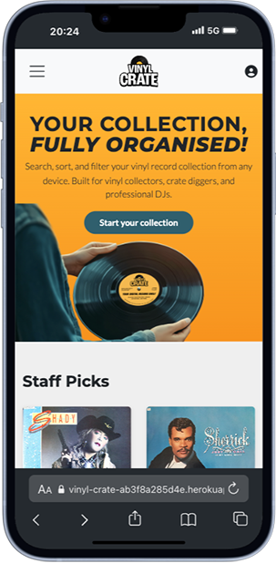
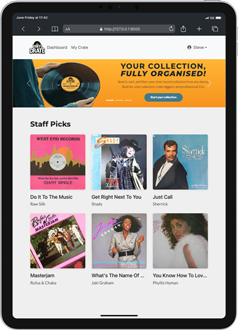
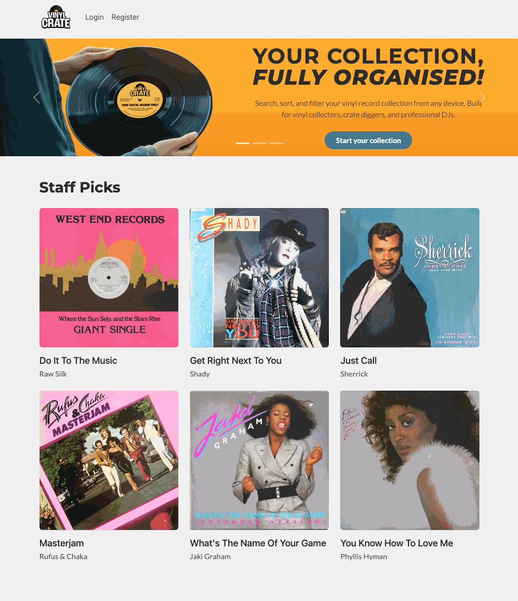
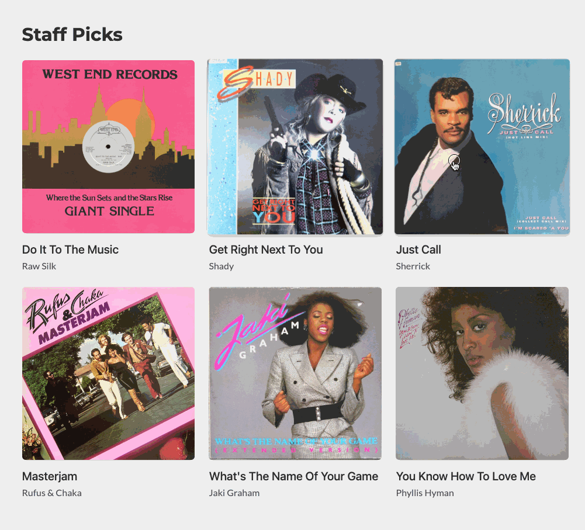
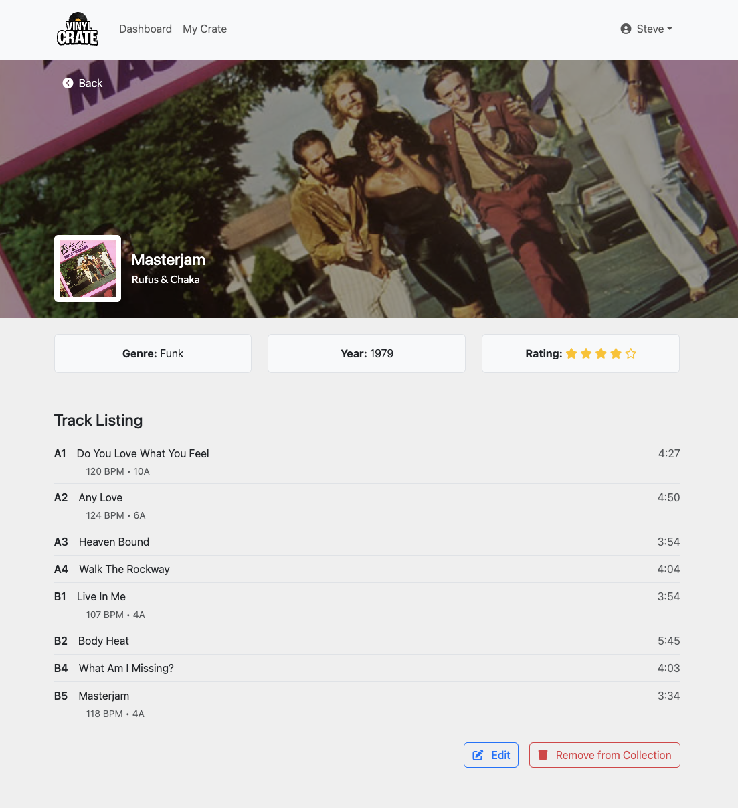
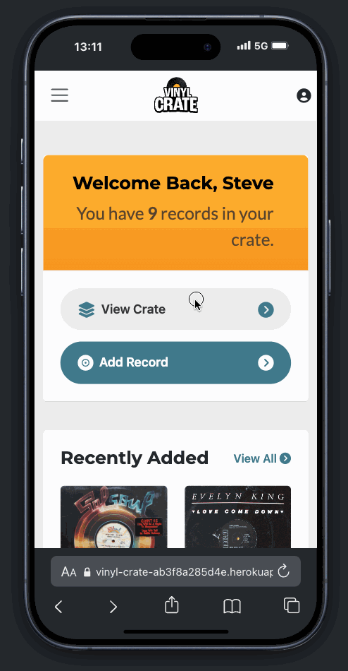
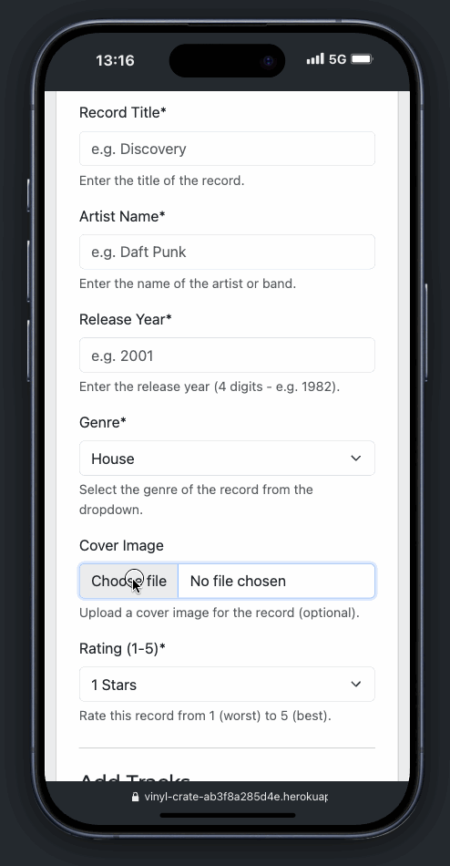
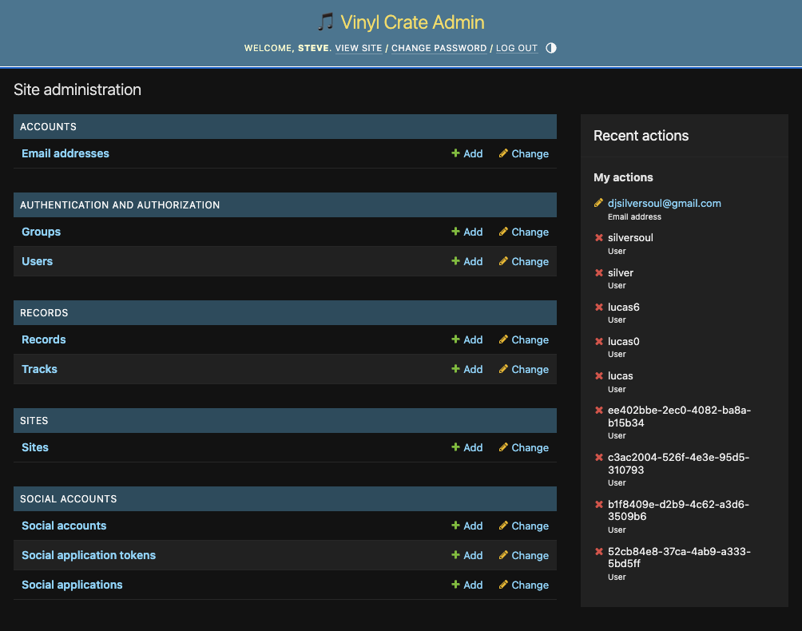
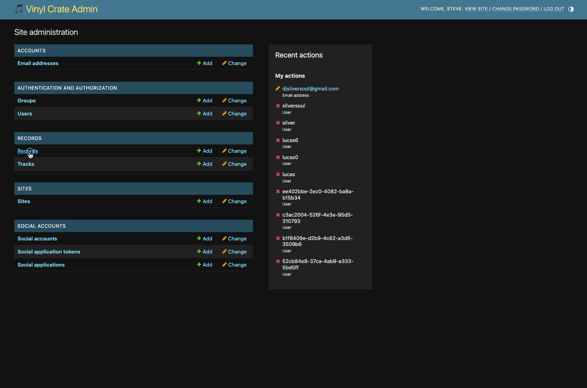
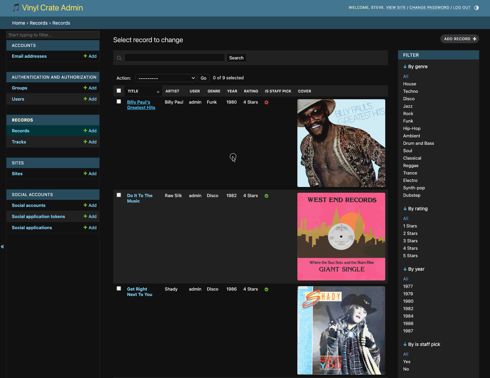

# Vinyl Crate - Testing

--

> [!NOTE]  
> Return back to the [README.md](README.md) file.

This document outlines the testing processes and results for the **Vinyl Crate** application. It ensures that all key features function correctly, provide a responsive and accessible user experience, and meet the expectations defined by the project requirements. Both manual and automated testing methods were used throughout the development process.

---

## CONTENTS

- [VALIDATION TESTING](#validation-testing)
  - [W3C Validator](#w3c-validation)
  - [W3C CSS Validator](#css-validation)
  - [JavaScript Validator](#js-validation)
  - [Python Validator](#python-validation)
  - [Lighthouse](#lighthouse)
- [AUTOMATED TESTING](#automated-testing)
- [MANUAL TESTING](#manual-testing)
  - [Full Testing](#full-testing)
  - [Browser Compatibility](#browser)
  - [Responsiveness](#responsiveness)
  - [Accessibility](#accessibility)
  - [Testing User Stories](#testing-user)
  - [Features Testing](#features-test)
  - [Existing Features](#existing-features)
  - [Manual Features Testing](#manual-features-test)

 

Testing was an **integral part of the development process**, ensuring that the Vinyl Crate application remained both **functional and user-friendly** at every stage. Through **continuous testing**, issues were identified and resolved early, contributing to a smoother development workflow and a more reliable final product.

**Chrome Developer Tools** were used extensively to monitor page responsiveness, diagnose styling and layout issues, and debug JavaScript and form interactions. This allowed for efficient troubleshooting and performance tuning during both frontend and backend development.

**ChatGPT** was a key support resource throughout the project. It helped refine user flows, debug Django logic, structure testing strategies, and optimize content and interface decisions. The guidance received led to more maintainable code, better practices, and improved overall project quality.

To ensure the site was **responsive and accessible across devices**, all views and forms were manually tested on a range of screen sizes using Chrome’s responsive design mode, alongside physical testing on **desktops, laptops, tablets, and smartphones**. Special attention was given to form interactions, navigation flow, and data display across breakpoints to guarantee a **consistent user experience**.

---

## Validation Testing

### W3C Validator

[W3C Validator](https://validator.w3.org/) was used to check the HTML and CSS across all pages of the site. Since Django’s templating language is embedded within the HTML files, I viewed the rendered page source in the browser and submitted that output to the validator to ensure accuracy.

| Page tested | Result | Evidence |
| --------- | ------ | ---------- |
| Home | Pass | [Home Page Validation](documentation/testing/validation/w3c-home.webp) |
| Dashboard | Pass | [Dashboard Page Validation](documentation/testing/validation/w3c-dashboard.webp) |
| My Crate  | Pass | [My Crate Page Validation](documentation/testing/validation/w3c-my-crate.webp) |
| Record Detail  | Pass | [Record Detail Page Validation](documentation/testing/validation/w3c-record-detail.webp) |
| 400  | Pass | [404 Page Validation](documentation/testing/validation/w3c-400.webp) |
| 403  | Pass | [404 Page Validation](documentation/testing/validation/w3c-403.webp) |
| 404  | Pass | [404 Page Validation](documentation/testing/validation/w3c-404.webp) |
| 500  | Pass | [500 Page Validation](documentation/testing/validation/w3c-500.webp) |

---

### CSS Validator

[CSS W3C Validator](https://jigsaw.w3.org/css-validator/) was used to validate my CSS file.

| File tested | Result | Evidence |
| ----------- | ------ | -------- |
| base/style.css | Pass | [base/style.css validation](documentation/testing/validation/w3c-style-css.webp) |

---

### JavaScript

All JavaScript was validated using [JSHint](https://jshint.com/) to ensure proper syntax, code quality, and adherence to best practices.

| File tested | Result | Evidence | Notes |
| ----------- | ------ | -------- | ----- |
| static/js/track_formset.js | Pass | [track_formset.js](documentation/testing/validation/javascript-track_formset.webp) | There were 17 initial warnings -  11 instances of `'const' is available in ES6 (use 'esversion: 6') or Mozilla JS extensions (use moz).` 3 instances of `'arrow function syntax (=>)' is only available in ES6 (use 'esversion: 6').` 3 instances of `'template literal syntax' is only available in ES6 (use 'esversion: 6').` JSHint is warning you that async functions are only supported in ES8 (ECMAScript 2017), but it is currently set to an older ECMAScript version. I updated the JSHint configuration to ES8 using this code `/*jshint esversion: 8 */`. |

---

### Python Validator

All Python code was validated using the [Code Institute Python Linter](https://pep8ci.herokuapp.com/), which checks for compliance with PEP8 — the official Python style guide. This ensured consistent, readable, and well-structured code throughout the project.

| File | Result | Evidence |
| :--- | :--- | :---: |
| **VINYLCRATE_PROJECT** |
| records/asgi.py | Pass | [asgi.py validation](documentation/testing/validation/python-asgi.webp) |
| records/settings.py | Pass | [admin.py validation](documentation/testing/validation/python-settings.webp) |
| records/urls.py | Pass | [urls.py validation](documentation/testing/validation/python-project-urls.webp) |
| records/wsgi.py | Pass | [wsgi.py validation](documentation/testing/validation/python-wsgi.webp) |
| **RECORDS** |
| records/admin.py | Pass | [admin.py validation](documentation/testing/validation/python-admin.webp) |
| records/apps.py | Pass | [apps.py validation](documentation/testing/validation/python-apps.webp) |
| records/forms.py | Pass | [forms.py validation](documentation/testing/validation/python-forms.webp) |
| records/models.py | Pass | [models.py validation](documentation/testing/validation/python-models.webp) |
| records/urls.py | Pass | [urls.py validation](documentation/testing/validation/python-urls.webp) |
| records/views.py | Pass | [views.py validation](documentation/testing/validation/python-views.webp) |
| records/tests_admin.py | Pass | [tests_admin.py validation](documentation/testing/validation/python-tests_admin.webp) |
| records/tests_forms_signup.py | Pass | [tests_forms_signup.py validation](documentation/testing/validation/python-tests_forms_signup.webp) |
| records/tests_forms_track.py | Pass | [tests_forms_track.py validation](documentation/testing/validation/python-tests_forms_track.webp) |
| records/tests_forms_record.py | Pass | [tests_forms_record.py validation](documentation/testing/validation/python-tests_forms_record.webp) |
| records/tests_views.py | Pass | [tests_views.py validation](documentation/testing/validation/python-tests_views.webp) |

### Lighthouse

I've tested my deployed project using the Lighthouse Audit tool to test the performance, accessibility, best practices and SEO of the website.

| Page | Mobile | Desktop | Notes |
| :--: | :--: | :--: | :--: |
| Home |  |  | ✅ Passed with great results |
| Record Detail |  |  | ✅ Passed with great results |
| 404 |  |  | ✅ Passed with great results |
| 500 |  |  | ✅ Passed with great results |

---

## Automated Testing

Automated testing was a critical part of the development process for **Vinyl Crate**, ensuring that key components of the application worked reliably across various user scenarios. The testing suite was designed to cover **models, forms, views, and admin methods** using Django’s built-in [TestCase](https://docs.djangoproject.com/en/4.1/topics/testing/overview/) framework, supported by [coverage](https://pypi.org/project/coverage/) for reporting.

### Scope of Automated Testing

The automated test suite was planned and executed to cover the following key areas:

#### Models
- **Record** and **Track** models
- Field definitions, validation constraints, default values, and foreign key relationships
- Basic model creation with valid and invalid data

#### Forms
- **RecordForm**, **TrackForm**, and **CustomSignupForm**
- Required field validation, custom error messages, widget rendering
- Optional vs required fields behaviour (e.g. blank BPM or musical key)
- Edge cases, such as rating and BPM outside allowed range, or invalid year input

#### Views
- Coverage of all major views:
  - `index`, `record_list`, `record_detail`
  - `record_create`, `record_update`, `record_delete`
  - `record_collection`, and `custom_404_view`
- GET and POST requests tested using `client.get()` and `client.post()`
- Authentication requirements enforced and verified
- Context data verified (e.g. record queryset, staff picks, filter options)
- Template rendering assertions using `assertTemplateUsed`

#### Admin
- `cover_thumb()` logic tested explicitly
- Ensures graceful fallback for records with missing or broken images
- Admin display robustness validated separately from frontend logic

#### User Flow
- Simulated signup flow using `CustomSignupForm`
- Verifies correct storage of first and last name fields
- Checks that optional fields do not block signup
- Error handling for missing username or password mismatches

#### Tools Used

| Tool | Purpose |
| ---- | ------- |
| Django TestCase | Core unit and integration test framework |
| Client() | Simulates authenticated and anonymous users |
| coverage.py | Measures line and branch coverage |
| htmlcov/ | Visual review of missed lines and test quality |

#### Test Files

| File Name | Contents | 
| ---- | ------- |
| tests_forms_record.py | RecordForm validation and required field logic |
| tests_forms_track.py | TrackForm validation, optional fields, and data types |
| tests_forms_signup.py | Signup logic and first/last name persistence |
| tests_views.py | All key views covered including CRUD and 404 |
| tests_admin.py | Admin thumbnail image rendering logic |

#### Coverage Testing

Testing was monitored using `coverage.py`, and line-by-line analysis was conducted to identify and address gaps. Areas typically hard to reach (like admin methods or error branches) were tested explicitly. Coverage reached a high level, with all business-critical logic tested and documented.

| Coverage for | Total | Evidence |
| ------------ | ----- | -------- |
| Records      | 96%   | [Coverage Records](documentation/testing/validation/coverage_records.webp) |

#### Edge Cases Covered
- Submitting forms with missing, invalid, or out-of-range data
- Submitting a record with no title (invalid)
- Filtering/searching records with multiple query params
- Authenticated vs unauthenticated access (e.g. attempting to view a record without login)
- Trying to update/delete records not owned by the user
- Rendering views with no records (empty states and onboarding)
- Handling missing or corrupted image files in the admin interface
- Custom 404 handling with missing templates and bad URLs

### Summary

This comprehensive automated test suite ensures that Vinyl Crate is robust, secure, and scalable. It gave confidence to iterate rapidly, knowing that regressions would be caught early in development.

--

## Manual Testing

### Full Testing

This section outlines the **manual testing** process conducted to ensure the Vinyl Crate web application functions correctly across all major user interactions, devices, and screen sizes. Testing focused on form validation, navigation flows, responsiveness, and general usability. Each feature was tested systematically to identify potential issues related to layout, logic, or access control.

Additional feedback was gathered through informal testing by friends and family on a variety of devices and browsers to further validate the user experience and cross-device compatibility.

### Browser Compatibility

- [Safari](https://www.apple.com/uk/safari/)
- [Chrome](https://www.google.com/chrome)
- [Firefox](https://www.mozilla.org/firefox)
- [Bing](https://www.bing.com/)
- [Edge](https://www.microsoft.com/en-gb/edge?form=MA13FJ)

I tested my deployed project on multiple browsers to check for compatibility issues.

---

### Responsiveness

In addition to testing my deployed site on different devices, I thoroughly tested its responsiveness using Chrome Developer Tools.  
I researched the **narrowest width of modern devices** on [Stack Exchange](https://ux.stackexchange.com/questions/74798/are-there-devices-narrower-than-320px-and-data-on-their-usage-for-web-browsing) and based my testing on **320px** as a standard minimum width.  
Additionally, I used the [Mobile First Plugin](https://www.webmobilefirst.com/en/), a Chrome extension designed to test site responsiveness across different devices.

#### Mobile Devices

| Device tested | Screen Width (px) | Screen Height (px) | Result | Notes (Issues Found) |
| :---: | :---: | :---: | :---: | :---: |
| iPhone 5  | iPhone 12/13/14  | Google Pixel 8  | iPhone 16 Pro Max  |
| iPhone 5 | 320px | 568px | ✅ Pass | 🛠️ Removed background image and filled screen with panel |
| iPhone 12/13/14 | 390px | 844px | ✅ Pass | 🛠️ Set info panel to hidden when other panels are visible |
| Google Pixel 8 | 412px | 916px | ✅ Pass | 🛠️ Set info panel to hidden when other panels are visible |
| iPhone 16 Pro Max | 440px | 956px | ✅ Pass | 🛠️ Set info panel to hidden when other panels are visible |

#### Tablets

| Device tested | Screen Width (px) | Screen Height (px) | Result | Notes (Issues Found) |
| :---: | :---: | :---: | :---: | :---: |
| iPad Mini  | Galaxy Tab S7  | iPad Pro 11  | | |
| iPad Mini | 768px | 1024px | ✅ Pass | 🛠️ Decreased margin spacing to improve UI |
| Galaxy Tab S7 | 800px | 1280px | ✅ Pass | 🛠️ Decreased margin spacing to improve UI |
| iPad Pro 11 | 834px | 1194px | ✅ Pass | 🛠️ Decreased margin spacing to improve UI |

#### Laptops & Desktops

| Device tested | Screen Width (px) | Screen Height (px) | Result | Notes (Issues Found) |
| :---: | :---: | :---: | :---: | :---: |
| MacBook Air 13”  | Dell Latitude  | Macbook Pro 16"  | iMac 24"  | Full HD monitor  |
| MacBook Air 13” | 1280px | 800px | ✅ Pass | ✅ Fully responsive |
| Dell Latitude | 1440px | 809px | ✅ Pass | ✅ Fully responsive |
| Macbook Pro 16" | 1728px | 1085px | ✅ Pass | ✅ Fully responsive |
| iMac 24" | 2048px | 1142px | ✅ Pass | ✅ Fully responsive |
| Full HD monitor | 1920px  | 1080px | ✅ Pass | ✅ Fully responsive |

---

### Accessibility

#### Colour contrast compliance

In addition to the automated tests for accessibility standards, I used [WebAIM](https://webaim.org/resources/contrastchecker/) to test the contrast of the colours on the site for visually impaired users.

| Foreground colour | Background colour | Screenshot | Testing results |
| :-----------------: | :-----------------: | :---------------: | :---------------: |
| `#ffffff`         | `#252733`         | | ✅ Pass |
| `#151724`         | `#4f9aff`         | | ⛔️ Fail on small text   ✅  Pass on larger text and graphics |
| `#4eb738`         | `#252733`         | | ⛔️ Fail on small text   ✅  Pass on larger text and graphics |
| `#e83c5a`         | `#252733`         | | ⛔️ Fail on all text   ✅  Pass on graphics |
| `#f59527`         | `#252733`         | | ⛔️ Fail on small text   ✅  Pass on larger text and graphics |

---

---

### Testing User Stories

| User Story ID | As a/an      | I want to be able to ...                            | So that I can...                                         | How is this achieved? | Evidence |
|---------------|--------------|------------------------------------------------------|----------------------------------------------------------|------------------------|----------|
| **Viewing and Navigation** | | | | | |
| 1             | New Visitor  | Browse a public record or staff-picked collection    | See what the site is about before registering            | The homepage features a staff picks section with six records marked as staff picks in the admin panel, all publicly viewable without login. Unauthenticated users can click these entries to view full metadata, cover art, and track listings using the record_detail view, giving a sense of the app’s purpose and design before registering. |  |
| 2             | New Visitor  | View example record entries with metadata            | Understand how records are displayed and organised       | Public staff-picked records on the homepage link to detailed record pages rendered by the `record_detail` view. Each page displays full metadata including artist, title, genre, rating, release year, and cover image. If tracks are included, they are listed with optional BPM, key, and duration fields. This allows visitors to preview how records are structured and organised before signing up. |  |
| 9             | User         | View full details for a single record                | See all metadata and visuals in one place                | Each record in the user’s collection or the public staff-pick section links to a dedicated detail page (`record_detail` view). This page displays all metadata fields submitted through the form — including artist, title, genre, rating, release year, label, and notes — along with a cover image and a full tracklist table showing track name, BPM, musical key, and duration (if available). The layout is mobile-responsive and styled for clear presentation. |  |
| 23            | Mobile User  | Access my collection on a phone or tablet            | View or update records while crate digging or DJing      | **Vinyl Crate** is built using responsive design principles and tested across multiple mobile and tablet devices using Chrome DevTools and physical devices. All views — including the dashboard, record detail pages, and add/edit forms — adjust layout and font sizes to suit smaller screens. Navigation menus adapt using a mobile-friendly hamburger menu, ensuring users can access, view, and update their collection on the go with full functionality. |  |
| 24            | Mobile User  | Upload cover images from my device                   | Add new records quickly without needing a computer       | The Add Record form supports image uploads via mobile devices using the `<input type="file">` field. Users can select a photo from their phone’s gallery or take one directly using their camera. The form has been tested on mobile browsers to ensure file inputs work correctly and integrate seamlessly with Cloudinary, which stores and serves uploaded images responsively. |  |
| **Registration and user accounts** | | | | | |
| 3             | New Visitor  | See a clear sign-up or log-in prompt                 | Know how to get started                                  |                        |          |
| 4             | User         | Register and log in                                  | Access my personal dashboard and collection              |                        |          |
| 14            | User         | Recover my password                                  | Regain access if I forget my login details               |                        |          |
| 15            | User         | Edit my account profile                              | Update my display name, location, or bio                 |                        |          |
| 16            | User         | Sign in via social media (optional)                  | Log in more quickly or conveniently                      |                        |          |
| **Sorting and searching** | | | | | |
| 5             | User         | Add new records to my collection                     | Keep an up-to-date log of the vinyl I own                |                        |          |
| 6             | User         | Upload a cover image for a record                    | Make my collection visually rich                         |                        |          |
| 7             | User         | Edit existing records                                | Correct mistakes or update metadata                      |                        |          |
| 8             | User         | Delete a record from my collection                   | Keep my library clean and relevant                       |                        |          |
| 10            | User         | Sort and filter my collection                        | Quickly find records by genre, BPM, or rating            |                        |          |
| 11            | User         | Search for a specific record                         | Find entries fast without scrolling                      |                        |          |
| 12            | User         | Rate a record using 1–5 stars                        | Track how much I value or enjoy a record                 |                        |          |
| 13            | User         | Export my collection as a CSV                        | Back it up or use it in another system                   |                        |          |
| 17            | User         | Add individual tracks to each record                 | Log full tracklists for more detailed entries            |                        |          |
| 18            | User         | Include BPM, key, and duration for each track        | Help with DJing or playlist curation                     |                        |          |
| **Administration** | | | | | |        
| 19            | Admin   | Access the Django admin panel                 | Manage users and records directly           | The Django admin panel is enabled and secured behind authentication. Superusers created via the Django shell or `createsuperuser` command can access `/admin/` to manage all site models. |  |
| 20            | Admin   | Edit or delete any record in the system       | Support users and maintain database integrity | From the admin panel, administrators can view, add, edit, and delete `User`, `Record`, and `Track` entries. Permissions are restricted so that only authenticated staff users can perform these actions. |  |
| 21            | Admin   | Review user-submitted content                   | Ensure the platform remains clean and appropriate      | Admin users can browse the full database of records submitted by users via the Django admin panel. From there, entries can be reviewed for appropriateness, edited if needed, or removed entirely. Staff-only access ensures moderation control. |  |
| 22            | Admin   | Manage tracks directly from the Record admin view | Save time editing metadata without switching models     | An inline formset is configured in the Django admin so that related `Track` entries can be viewed and managed directly from the `Record` admin page. This streamlines editing without needing to open each track individually. |  |

---

## Conclusion

Through a combination of validation tools, automated test coverage, manual cross-browser and device testing, and accessibility checks, Vinyl Crate has been rigorously tested to ensure a robust, user-friendly, and inclusive experience. Remaining areas for improvement (e.g. enhanced screen reader testing or extending JavaScript test coverage) have been noted and could form part of future iterations.